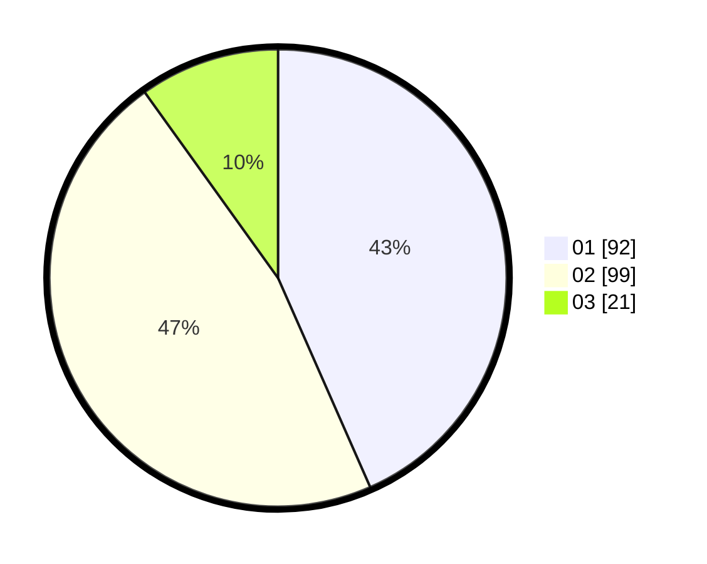

# Hasil

Hasil perolehan suara paslon dapat dilihat pada file paslon-01.txt, paslon-02.txt, dan paslon-03.txt.

Jika tidak ada, artinya data tersebut belum ada pada SIREKAP.

## Perolehan Suara

 * Paslon 01: **92**.
 * Paslon 02: **99**.
 * Paslon 03: **21**.

## Foto C Plano

https://sirekap-obj-formc.kpu.go.id/966f/pemilu/ppwp/31/72/03/10/04/3172031004087-20240215-005826--1139c4bc-05b4-4dcf-9b70-f35f9a3fe7dd.jpg

https://sirekap-obj-formc.kpu.go.id/966f/pemilu/ppwp/31/72/03/10/04/3172031004087-20240217-105916--e9054380-8f5a-4727-be79-f5bc911030e6.jpg

https://sirekap-obj-formc.kpu.go.id/966f/pemilu/ppwp/31/72/03/10/04/3172031004087-20240215-010558--432d4336-3cab-4814-9222-046f82a4d0b6.jpg

## DATA PEMILIH TETAP

Jumlah pemilih dalam DPT: **284**.
 * L: **155**.
 * P: **129**.

## DATA PENGGUNA HAK PILIH

Jumlah pengguna hak pilih dalam DPT: **214**.
 * L: **111**.
 * P: **103**.

Jumlah pengguna hak pilih dalam DPTb: **0**.
 * L: **0**.
 * P: **0**.

Jumlah pengguna hak pilih dalam DPK: **3**.
 * L: **3**.
 * P: **0**.

Jumlah pengguna hak pilih: **217**.
 * L: **114**.
 * P: **103**.

## JUMLAH SUARA SAH DAN TIDAK SAH

JUMLAH SELURUH SUARA SAH: **212**.

JUMLAH SUARA TIDAK SAH: **5**.

JUMLAH SELURUH SUARA SAH DAN SUARA TIDAK SAH: **217**.
