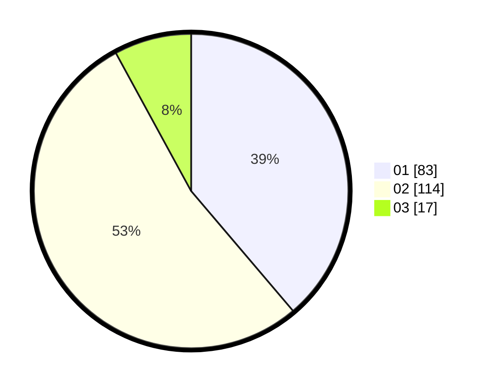

# Hasil

Hasil perolehan suara paslon dapat dilihat pada file paslon-01.txt, paslon-02.txt, dan paslon-03.txt.

Jika tidak ada, artinya data tersebut belum ada pada SIREKAP.

## Perolehan Suara

 * Paslon 01: **83**.
 * Paslon 02: **114**.
 * Paslon 03: **17**.

## Foto C Plano

https://sirekap-obj-formc.kpu.go.id/c5b3/pemilu/ppwp/31/72/03/10/04/3172031004091-20240215-021553--2066ff70-55ea-4da8-806f-11df8dd1a8b9.jpg

https://sirekap-obj-formc.kpu.go.id/c5b3/pemilu/ppwp/31/72/03/10/04/3172031004091-20240214-201528--283889e0-4d43-424e-9434-dfaf48a73ab4.jpg

https://sirekap-obj-formc.kpu.go.id/c5b3/pemilu/ppwp/31/72/03/10/04/3172031004091-20240214-201731--2d8a7223-4960-4a51-992c-6ffeb0b4d923.jpg
