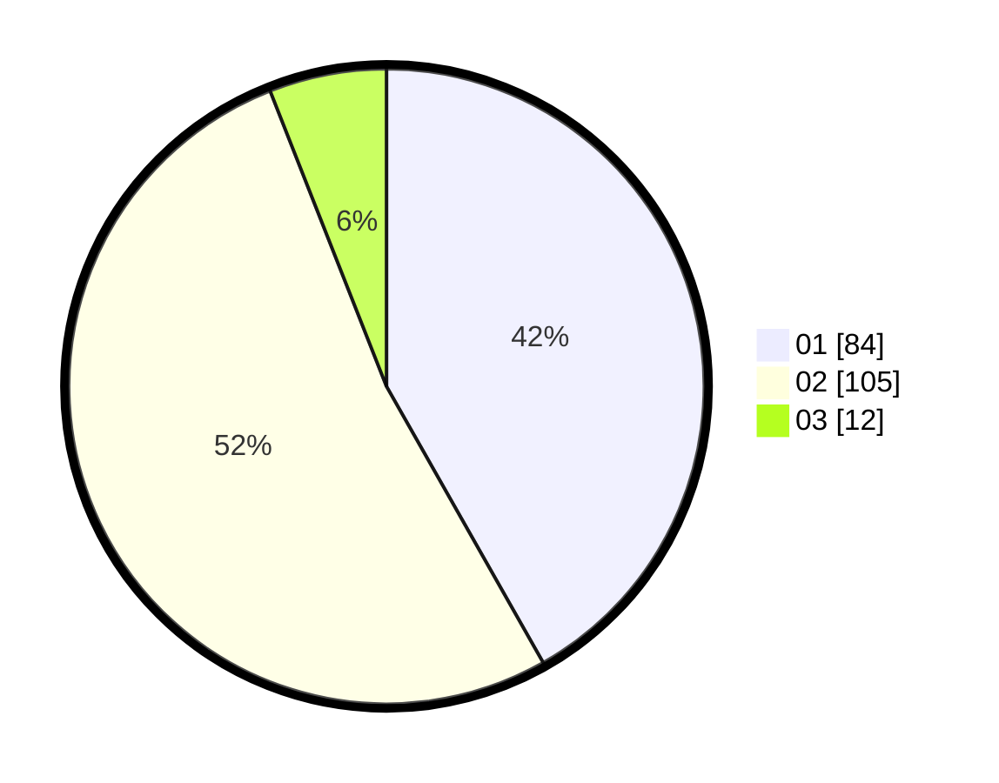

# Hasil

Hasil perolehan suara paslon dapat dilihat pada file paslon-01.txt, paslon-02.txt, dan paslon-03.txt.

Jika tidak ada, artinya data tersebut belum ada pada SIREKAP.

## Perolehan Suara

 * Paslon 01: **84**.
 * Paslon 02: **105**.
 * Paslon 03: **12**.

## Foto C Plano

https://sirekap-obj-formc.kpu.go.id/2ead/pemilu/ppwp/31/72/03/10/04/3172031004092-20240214-222118--ad21b4cb-b337-4fc8-b030-54aab9459b58.jpg

https://sirekap-obj-formc.kpu.go.id/2ead/pemilu/ppwp/31/72/03/10/04/3172031004092-20240215-013019--8893a4b3-45e7-4e28-b76a-95fe87e0bf58.jpg

https://sirekap-obj-formc.kpu.go.id/2ead/pemilu/ppwp/31/72/03/10/04/3172031004092-20240215-013208--548af7cb-9e5b-42a0-a0ee-cb694aef9c06.jpg
