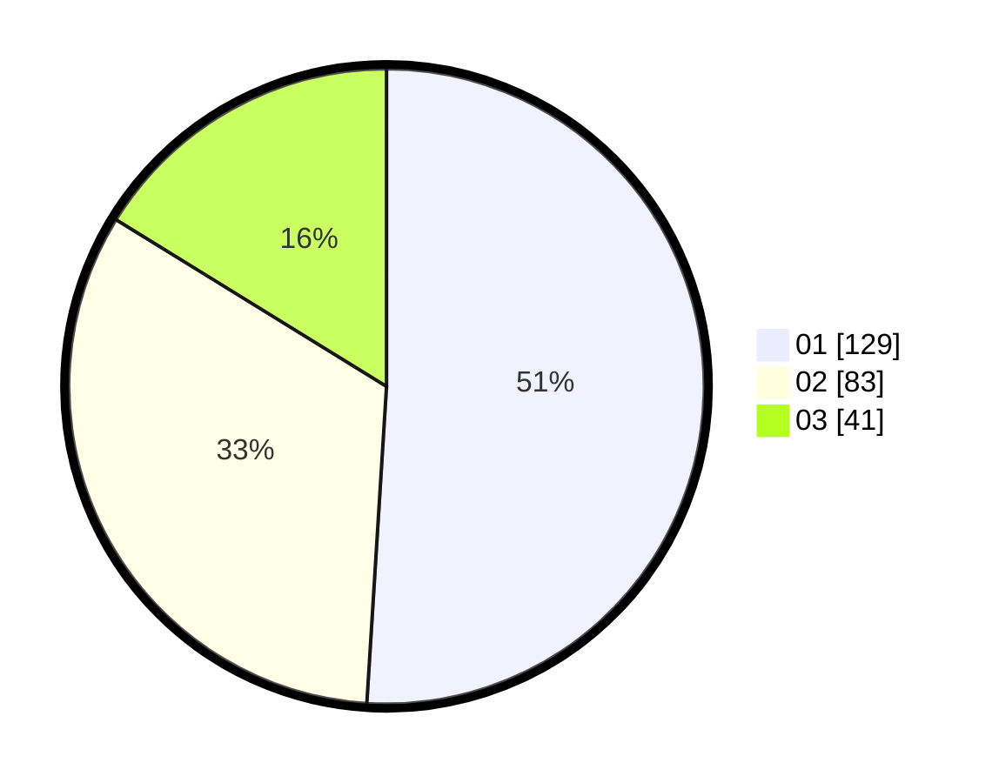

# Hasil

Hasil perolehan suara paslon dapat dilihat pada file paslon-01.txt, paslon-02.txt, dan paslon-03.txt.

Jika tidak ada, artinya data tersebut belum ada pada SIREKAP.

## Perolehan Suara

 * Paslon 01: **129**.
 * Paslon 02: **83**.
 * Paslon 03: **41**.

## Foto C Plano

https://sirekap-obj-formc.kpu.go.id/723f/pemilu/ppwp/31/72/03/10/04/3172031004094-20240215-010639--96261d28-4b94-4cdb-a382-a44f0857a023.jpg

https://sirekap-obj-formc.kpu.go.id/723f/pemilu/ppwp/31/72/03/10/04/3172031004094-20240215-010702--fcffacbe-3e67-4f9c-acb9-e58e703c5dad.jpg

https://sirekap-obj-formc.kpu.go.id/723f/pemilu/ppwp/31/72/03/10/04/3172031004094-20240215-010718--0359e9ff-a5e3-4857-a1d6-a28e5cc3a1f8.jpg

## DATA PEMILIH TETAP

Jumlah pemilih dalam DPT: **300**.
 * L: **140**.
 * P: **160**.

## DATA PENGGUNA HAK PILIH

Jumlah pengguna hak pilih dalam DPT: **254**.
 * L: **109**.
 * P: **145**.

Jumlah pengguna hak pilih dalam DPTb: **8**.
 * L: **7**.
 * P: **1**.

Jumlah pengguna hak pilih dalam DPK: **4**.
 * L: **2**.
 * P: **2**.

Jumlah pengguna hak pilih: **266**.
 * L: **118**.
 * P: **148**.

## JUMLAH SUARA SAH DAN TIDAK SAH

JUMLAH SELURUH SUARA SAH: **253**.

JUMLAH SUARA TIDAK SAH: **1**.

JUMLAH SELURUH SUARA SAH DAN SUARA TIDAK SAH: **254**.
