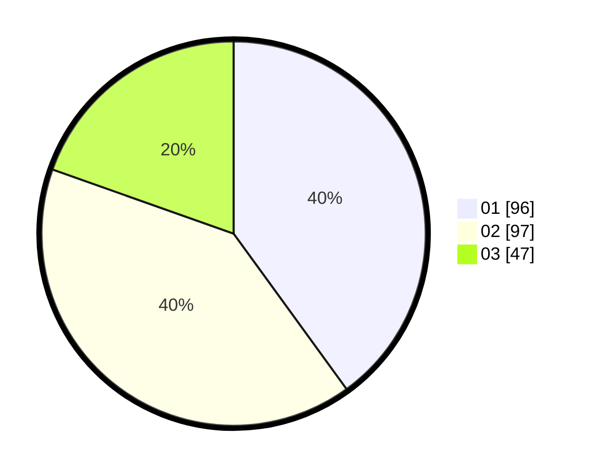

# Hasil

Hasil perolehan suara paslon dapat dilihat pada file paslon-01.txt, paslon-02.txt, dan paslon-03.txt.

Jika tidak ada, artinya data tersebut belum ada pada SIREKAP.

## Perolehan Suara

 * Paslon 01: **96**.
 * Paslon 02: **97**.
 * Paslon 03: **47**.

## Foto C Plano

https://sirekap-obj-formc.kpu.go.id/15d3/pemilu/ppwp/31/72/03/10/04/3172031004095-20240214-211209--d9a306ee-95df-4c1c-b335-d62ac4bb6443.jpg

https://sirekap-obj-formc.kpu.go.id/15d3/pemilu/ppwp/31/72/03/10/04/3172031004095-20240214-204455--a1ea6b84-d2cf-4079-903f-90f7c54f1ac4.jpg

https://sirekap-obj-formc.kpu.go.id/15d3/pemilu/ppwp/31/72/03/10/04/3172031004095-20240214-211349--58e25f9a-bc2d-47c2-aca7-d7bf57024b96.jpg

## DATA PEMILIH TETAP

Jumlah pemilih dalam DPT: **300**.
 * L: **140**.
 * P: **160**.

## DATA PENGGUNA HAK PILIH

Jumlah pengguna hak pilih dalam DPT: **245**.
 * L: **114**.
 * P: **131**.

Jumlah pengguna hak pilih dalam DPTb: **0**.
 * L: **0**.
 * P: **0**.

Jumlah pengguna hak pilih dalam DPK: **1**.
 * L: **0**.
 * P: **1**.

Jumlah pengguna hak pilih: **246**.
 * L: **114**.
 * P: **132**.

## JUMLAH SUARA SAH DAN TIDAK SAH

JUMLAH SELURUH SUARA SAH: **240**.

JUMLAH SUARA TIDAK SAH: **6**.

JUMLAH SELURUH SUARA SAH DAN SUARA TIDAK SAH: **246**.
