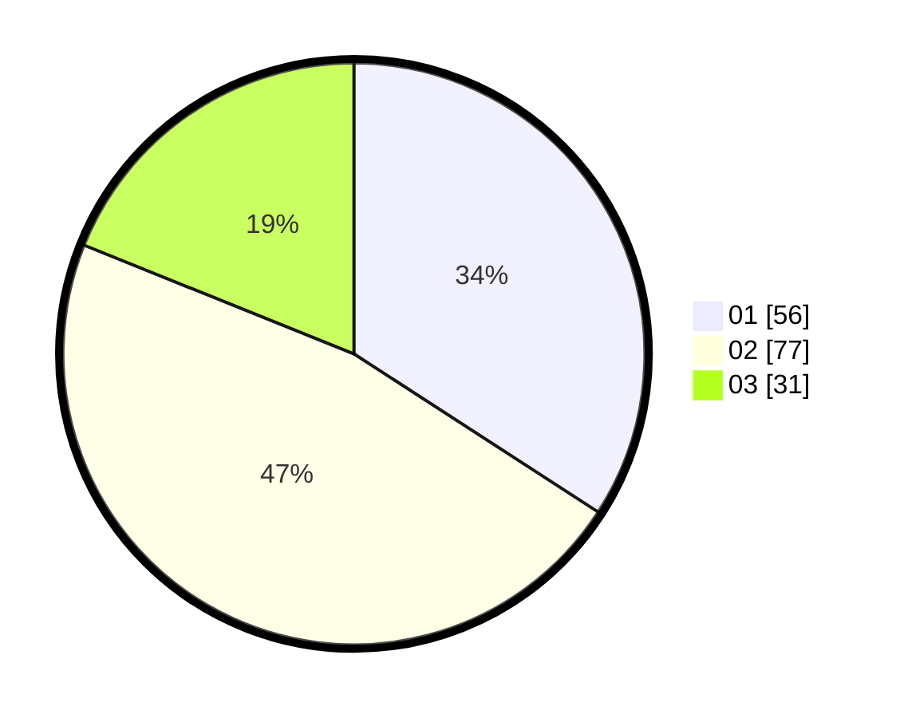

# Hasil

Hasil perolehan suara paslon dapat dilihat pada file paslon-01.txt, paslon-02.txt, dan paslon-03.txt.

Jika tidak ada, artinya data tersebut belum ada pada SIREKAP.

## Perolehan Suara

 * Paslon 01: **56**.
 * Paslon 02: **77**.
 * Paslon 03: **31**.

## Foto C Plano

https://sirekap-obj-formc.kpu.go.id/cc8d/pemilu/ppwp/31/72/03/10/04/3172031004106-20240215-143044--8431fac1-566a-4d3d-8ca5-232cb578123a.jpg

https://sirekap-obj-formc.kpu.go.id/cc8d/pemilu/ppwp/31/72/03/10/04/3172031004106-20240215-143105--db116ab6-f6a7-49b1-bcc3-578bd3e6c04e.jpg

https://sirekap-obj-formc.kpu.go.id/cc8d/pemilu/ppwp/31/72/03/10/04/3172031004106-20240215-143054--980d7f5a-64e3-4ccf-9caf-7632092cd810.jpg

## DATA PEMILIH TETAP

Jumlah pemilih dalam DPT: **208**.
 * L: **97**.
 * P: **111**.

## DATA PENGGUNA HAK PILIH

Jumlah pengguna hak pilih dalam DPT: **151**.
 * L: **73**.
 * P: **78**.

Jumlah pengguna hak pilih dalam DPTb: **14**.
 * L: **9**.
 * P: **5**.

Jumlah pengguna hak pilih dalam DPK: **0**.
 * L: **0**.
 * P: **0**.

Jumlah pengguna hak pilih: **165**.
 * L: **82**.
 * P: **83**.

## JUMLAH SUARA SAH DAN TIDAK SAH

JUMLAH SELURUH SUARA SAH: **164**.

JUMLAH SUARA TIDAK SAH: **1**.

JUMLAH SELURUH SUARA SAH DAN SUARA TIDAK SAH: **165**.
