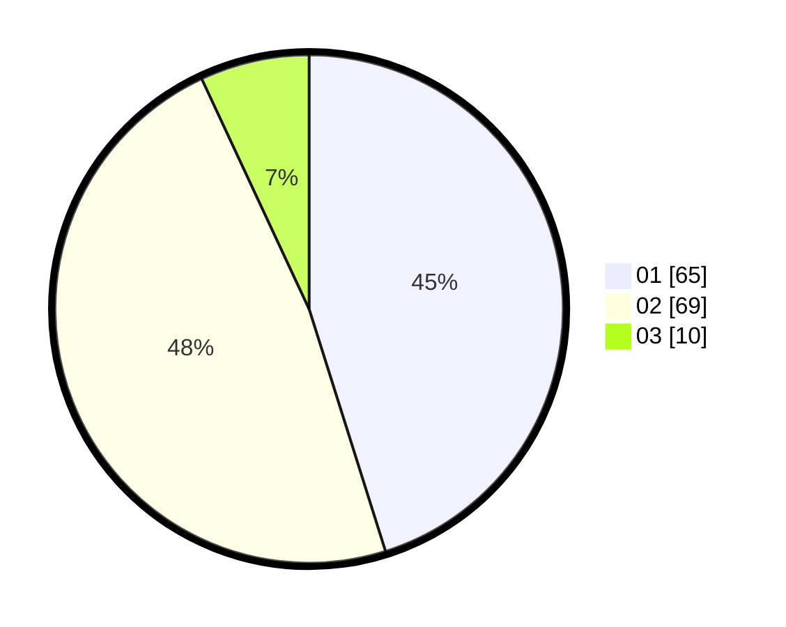

# Hasil

Hasil perolehan suara paslon dapat dilihat pada file paslon-01.txt, paslon-02.txt, dan paslon-03.txt.

Jika tidak ada, artinya data tersebut belum ada pada SIREKAP.

## Perolehan Suara

 * Paslon 01: **65**.
 * Paslon 02: **69**.
 * Paslon 03: **10**.

## Foto C Plano

https://sirekap-obj-formc.kpu.go.id/cb12/pemilu/ppwp/31/72/03/10/04/3172031004107-20240216-002138--315e92d2-baad-4a1f-b2e5-6c5764bb9a50.jpg

https://sirekap-obj-formc.kpu.go.id/cb12/pemilu/ppwp/31/72/03/10/04/3172031004107-20240216-002142--78a59b76-3e7f-4ead-956d-edbb1e8d7fed.jpg

https://sirekap-obj-formc.kpu.go.id/cb12/pemilu/ppwp/31/72/03/10/04/3172031004107-20240216-002140--f6d3ead3-3e5b-473d-a07f-e29f120ff006.jpg

## DATA PEMILIH TETAP

Jumlah pemilih dalam DPT: **219**.
 * L: **126**.
 * P: **93**.

## DATA PENGGUNA HAK PILIH

Jumlah pengguna hak pilih dalam DPT: **131**.
 * L: **71**.
 * P: **60**.

Jumlah pengguna hak pilih dalam DPTb: **14**.
 * L: **12**.
 * P: **2**.

Jumlah pengguna hak pilih dalam DPK: **0**.
 * L: **0**.
 * P: **0**.

Jumlah pengguna hak pilih: **145**.
 * L: **83**.
 * P: **62**.

## JUMLAH SUARA SAH DAN TIDAK SAH

JUMLAH SELURUH SUARA SAH: **144**.

JUMLAH SUARA TIDAK SAH: **1**.

JUMLAH SELURUH SUARA SAH DAN SUARA TIDAK SAH: **145**.
