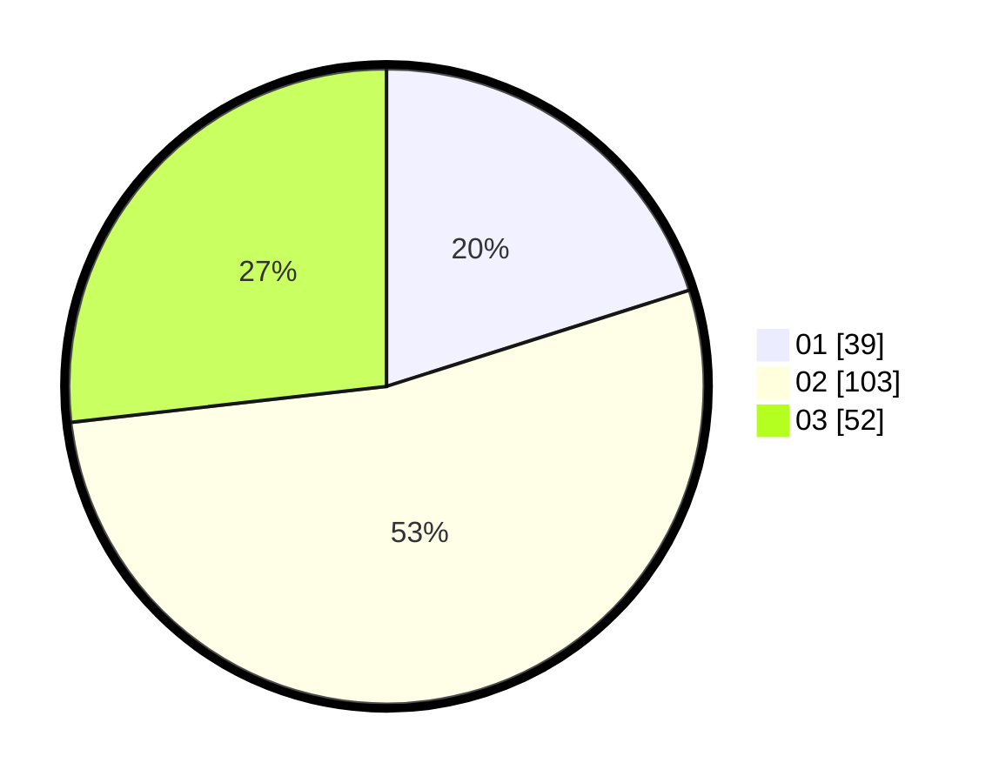

# Hasil

Hasil perolehan suara paslon dapat dilihat pada file paslon-01.txt, paslon-02.txt, dan paslon-03.txt.

Jika tidak ada, artinya data tersebut belum ada pada SIREKAP.

## Perolehan Suara

 * Paslon 01: **39**.
 * Paslon 02: **103**.
 * Paslon 03: **52**.

## Foto C Plano

https://sirekap-obj-formc.kpu.go.id/f4e6/pemilu/ppwp/31/72/03/10/04/3172031004108-20240216-215437--5203d930-c812-4584-9e78-3cb66649a596.jpg

https://sirekap-obj-formc.kpu.go.id/f4e6/pemilu/ppwp/31/72/03/10/04/3172031004108-20240216-215438--60ae1d22-9ed5-4cbe-99dc-a22fe3bfcd5b.jpg

https://sirekap-obj-formc.kpu.go.id/f4e6/pemilu/ppwp/31/72/03/10/04/3172031004108-20240216-215438--d376d59d-37d1-486d-9958-d8ad368aabcc.jpg

## DATA PEMILIH TETAP

Jumlah pemilih dalam DPT: **269**.
 * L: **124**.
 * P: **145**.

## DATA PENGGUNA HAK PILIH

Jumlah pengguna hak pilih dalam DPT: **180**.
 * L: **80**.
 * P: **100**.

Jumlah pengguna hak pilih dalam DPTb: **17**.
 * L: **16**.
 * P: **1**.

Jumlah pengguna hak pilih dalam DPK: **0**.
 * L: **0**.
 * P: **0**.

Jumlah pengguna hak pilih: **0**.
 * L: **0**.
 * P: **0**.

## JUMLAH SUARA SAH DAN TIDAK SAH

JUMLAH SELURUH SUARA SAH: **194**.

JUMLAH SUARA TIDAK SAH: **3**.

JUMLAH SELURUH SUARA SAH DAN SUARA TIDAK SAH: **197**.
