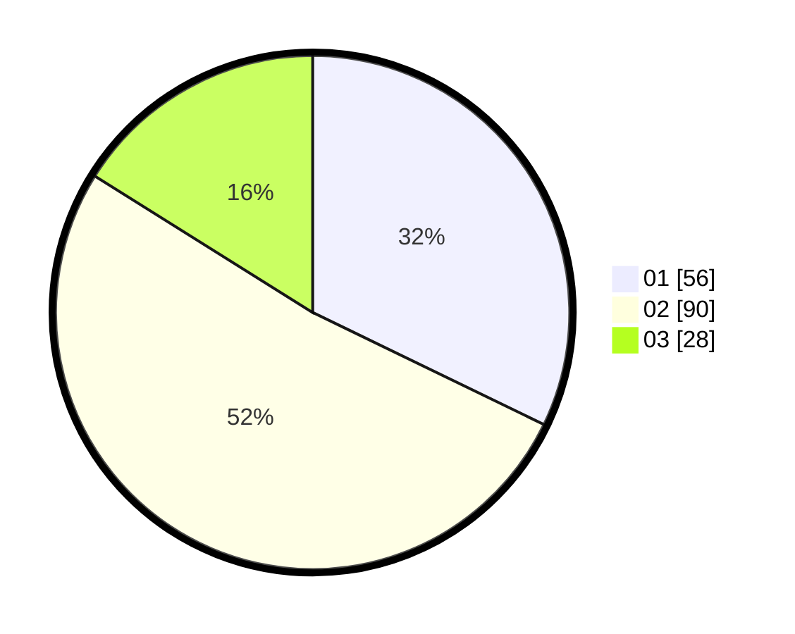

# Hasil

Hasil perolehan suara paslon dapat dilihat pada file paslon-01.txt, paslon-02.txt, dan paslon-03.txt.

Jika tidak ada, artinya data tersebut belum ada pada SIREKAP.

## Perolehan Suara

 * Paslon 01: **56**.
 * Paslon 02: **90**.
 * Paslon 03: **28**.

## Foto C Plano

https://sirekap-obj-formc.kpu.go.id/604b/pemilu/ppwp/31/72/03/10/04/3172031004110-20240214-184530--38e28996-b0ec-4de1-a2d0-26d87447803b.jpg

https://sirekap-obj-formc.kpu.go.id/604b/pemilu/ppwp/31/72/03/10/04/3172031004110-20240214-184517--cff93740-35d7-41da-89cb-89fd7ef85004.jpg

https://sirekap-obj-formc.kpu.go.id/604b/pemilu/ppwp/31/72/03/10/04/3172031004110-20240214-184536--4edc449f-c972-4941-b9cd-6cbab97cc443.jpg

## DATA PEMILIH TETAP

Jumlah pemilih dalam DPT: **172**.
 * L: **88**.
 * P: **84**.

## DATA PENGGUNA HAK PILIH

Jumlah pengguna hak pilih dalam DPT: **244**.
 * L: **136**.
 * P: **108**.

Jumlah pengguna hak pilih dalam DPTb: **6**.
 * L: **3**.
 * P: **3**.

Jumlah pengguna hak pilih dalam DPK: **2**.
 * L: **1**.
 * P: **1**.

Jumlah pengguna hak pilih: **252**.
 * L: **140**.
 * P: **112**.

## JUMLAH SUARA SAH DAN TIDAK SAH

JUMLAH SELURUH SUARA SAH: **174**.

JUMLAH SUARA TIDAK SAH: **6**.

JUMLAH SELURUH SUARA SAH DAN SUARA TIDAK SAH: **180**.
