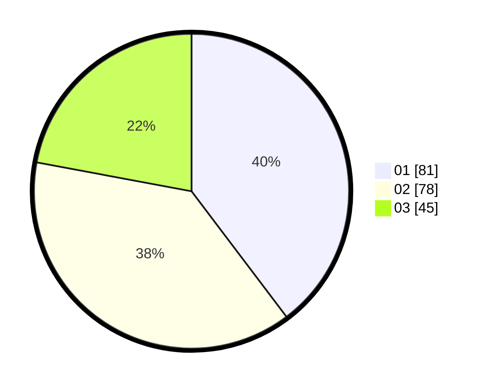

# Hasil

Hasil perolehan suara paslon dapat dilihat pada file paslon-01.txt, paslon-02.txt, dan paslon-03.txt.

Jika tidak ada, artinya data tersebut belum ada pada SIREKAP.

## Perolehan Suara

 * Paslon 01: **81**.
 * Paslon 02: **78**.
 * Paslon 03: **45**.

## Foto C Plano

https://sirekap-obj-formc.kpu.go.id/6534/pemilu/ppwp/31/72/03/10/04/3172031004113-20240216-020757--894fa857-86db-4b35-8803-351dd55e6001.jpg

https://sirekap-obj-formc.kpu.go.id/6534/pemilu/ppwp/31/72/03/10/04/3172031004113-20240216-020803--fafe15bf-5999-469d-8755-32f6708ad6cd.jpg

https://sirekap-obj-formc.kpu.go.id/6534/pemilu/ppwp/31/72/03/10/04/3172031004113-20240216-020801--06336fb0-6ad0-4d48-b933-3a58ae4ad61a.jpg

## DATA PEMILIH TETAP

Jumlah pemilih dalam DPT: **260**.
 * L: **118**.
 * P: **142**.

## DATA PENGGUNA HAK PILIH

Jumlah pengguna hak pilih dalam DPT: **202**.
 * L: **84**.
 * P: **118**.

Jumlah pengguna hak pilih dalam DPTb: **0**.
 * L: **0**.
 * P: **0**.

Jumlah pengguna hak pilih dalam DPK: **5**.
 * L: **2**.
 * P: **3**.

Jumlah pengguna hak pilih: **207**.
 * L: **86**.
 * P: **121**.

## JUMLAH SUARA SAH DAN TIDAK SAH

JUMLAH SELURUH SUARA SAH: **204**.

JUMLAH SUARA TIDAK SAH: **3**.

JUMLAH SELURUH SUARA SAH DAN SUARA TIDAK SAH: **207**.
