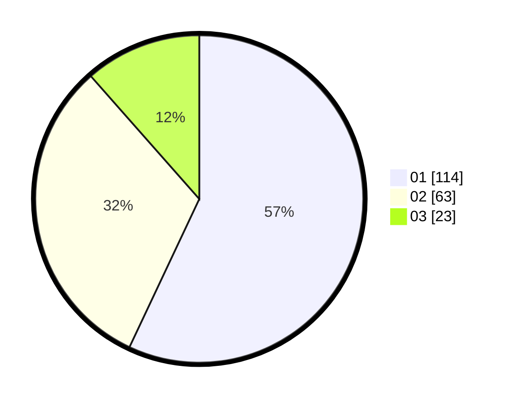

# Hasil

Hasil perolehan suara paslon dapat dilihat pada file paslon-01.txt, paslon-02.txt, dan paslon-03.txt.

Jika tidak ada, artinya data tersebut belum ada pada SIREKAP.

## Perolehan Suara

 * Paslon 01: **114**.
 * Paslon 02: **63**.
 * Paslon 03: **23**.

## Foto C Plano

https://sirekap-obj-formc.kpu.go.id/cbb2/pemilu/ppwp/31/72/03/10/04/3172031004114-20240214-202053--b6747cf1-2149-4339-b560-2b76d15b725a.jpg

https://sirekap-obj-formc.kpu.go.id/cbb2/pemilu/ppwp/31/72/03/10/04/3172031004114-20240214-232413--df11a052-a2e7-4e48-b4cb-038ed6020ba6.jpg

https://sirekap-obj-formc.kpu.go.id/cbb2/pemilu/ppwp/31/72/03/10/04/3172031004114-20240214-232047--a48bdd0c-3624-4902-ac86-6593c37c5d60.jpg

## DATA PEMILIH TETAP

Jumlah pemilih dalam DPT: **251**.
 * L: **129**.
 * P: **122**.

## DATA PENGGUNA HAK PILIH

Jumlah pengguna hak pilih dalam DPT: **200**.
 * L: **100**.
 * P: **100**.

Jumlah pengguna hak pilih dalam DPTb: **2**.
 * L: **1**.
 * P: **1**.

Jumlah pengguna hak pilih dalam DPK: **3**.
 * L: **2**.
 * P: **1**.

Jumlah pengguna hak pilih: **205**.
 * L: **103**.
 * P: **102**.

## JUMLAH SUARA SAH DAN TIDAK SAH

JUMLAH SELURUH SUARA SAH: **200**.

JUMLAH SUARA TIDAK SAH: **5**.

JUMLAH SELURUH SUARA SAH DAN SUARA TIDAK SAH: **205**.
