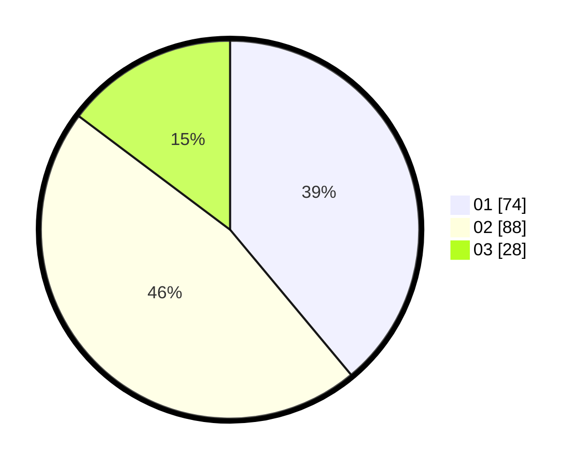

# Hasil

Hasil perolehan suara paslon dapat dilihat pada file paslon-01.txt, paslon-02.txt, dan paslon-03.txt.

Jika tidak ada, artinya data tersebut belum ada pada SIREKAP.

## Perolehan Suara

 * Paslon 01: **74**.
 * Paslon 02: **88**.
 * Paslon 03: **28**.

## Foto C Plano

https://sirekap-obj-formc.kpu.go.id/d8bd/pemilu/ppwp/31/72/03/10/04/3172031004115-20240216-175404--7d704901-89e8-4bd0-9855-b8c08743d256.jpg

https://sirekap-obj-formc.kpu.go.id/d8bd/pemilu/ppwp/31/72/03/10/04/3172031004115-20240216-175405--1b5b7e1e-4d42-40a2-b2c1-6bfe8a403a3c.jpg

https://sirekap-obj-formc.kpu.go.id/d8bd/pemilu/ppwp/31/72/03/10/04/3172031004115-20240216-175405--9ecafffa-bd61-4f4f-9740-50277e887b7a.jpg

## DATA PEMILIH TETAP

Jumlah pemilih dalam DPT: **0**.
 * L: **0**.
 * P: **0**.

## DATA PENGGUNA HAK PILIH

Jumlah pengguna hak pilih dalam DPT: **0**.
 * L: **0**.
 * P: **0**.

Jumlah pengguna hak pilih dalam DPTb: **0**.
 * L: **0**.
 * P: **0**.

Jumlah pengguna hak pilih dalam DPK: **0**.
 * L: **0**.
 * P: **0**.

Jumlah pengguna hak pilih: **0**.
 * L: **0**.
 * P: **0**.

## JUMLAH SUARA SAH DAN TIDAK SAH

JUMLAH SELURUH SUARA SAH: **190**.

JUMLAH SUARA TIDAK SAH: **2**.

JUMLAH SELURUH SUARA SAH DAN SUARA TIDAK SAH: **192**.
