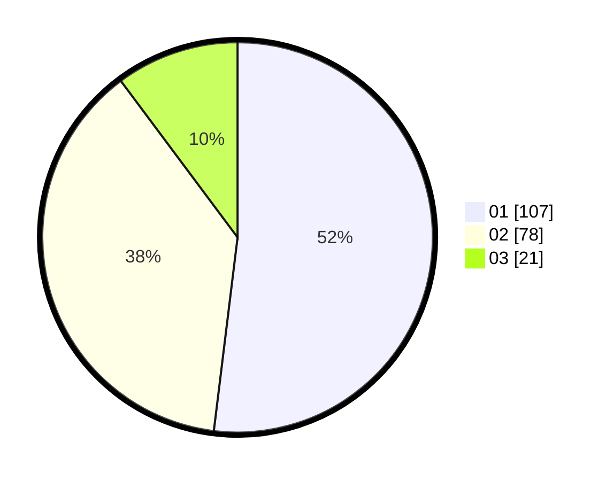

# Hasil

Hasil perolehan suara paslon dapat dilihat pada file paslon-01.txt, paslon-02.txt, dan paslon-03.txt.

Jika tidak ada, artinya data tersebut belum ada pada SIREKAP.

## Perolehan Suara

 * Paslon 01: **107**.
 * Paslon 02: **78**.
 * Paslon 03: **21**.

## Foto C Plano

https://sirekap-obj-formc.kpu.go.id/1428/pemilu/ppwp/31/72/03/10/05/3172031005027-20240215-011921--665cf432-6fa7-487d-bb40-7d41bffd58bb.jpg

https://sirekap-obj-formc.kpu.go.id/1428/pemilu/ppwp/31/72/03/10/05/3172031005027-20240215-012002--8064ae2a-5de5-488d-a9c7-0c7af9b55f7b.jpg
