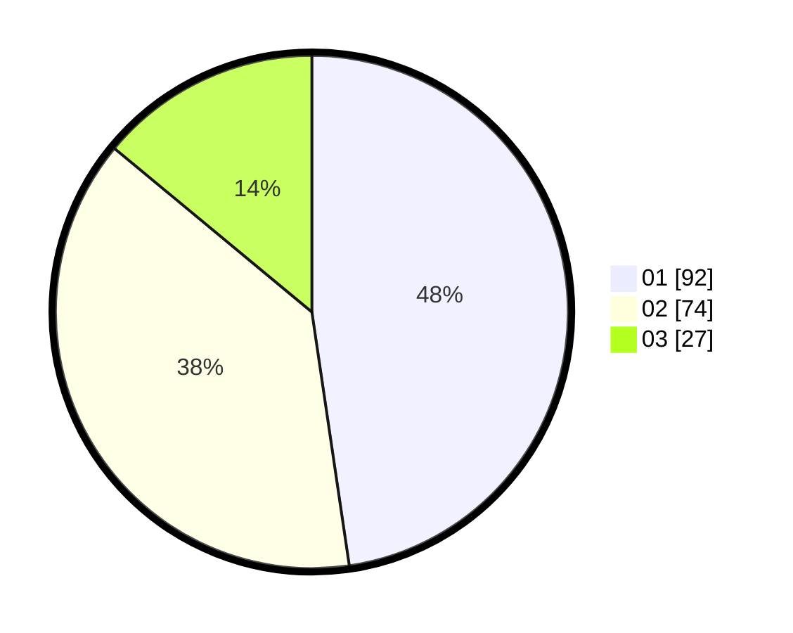

# Hasil

Hasil perolehan suara paslon dapat dilihat pada file paslon-01.txt, paslon-02.txt, dan paslon-03.txt.

Jika tidak ada, artinya data tersebut belum ada pada SIREKAP.

## Perolehan Suara

 * Paslon 01: **92**.
 * Paslon 02: **74**.
 * Paslon 03: **27**.

## Foto C Plano

https://sirekap-obj-formc.kpu.go.id/f6b3/pemilu/ppwp/31/72/03/10/05/3172031005032-20240215-040722--624e2a3f-29fb-42de-82a1-cae62c0f788e.jpg

https://sirekap-obj-formc.kpu.go.id/f6b3/pemilu/ppwp/31/72/03/10/05/3172031005032-20240214-233941--1878de3b-84ab-49e1-904e-3d9d61b5e47a.jpg

https://sirekap-obj-formc.kpu.go.id/f6b3/pemilu/ppwp/31/72/03/10/05/3172031005032-20240214-234021--0551ebf4-7514-43ad-af37-76979a73b872.jpg
