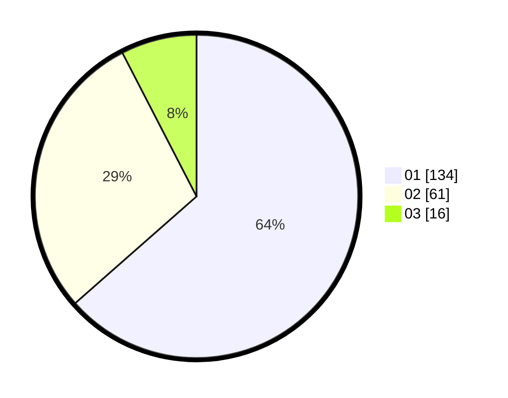

# Hasil

Hasil perolehan suara paslon dapat dilihat pada file paslon-01.txt, paslon-02.txt, dan paslon-03.txt.

Jika tidak ada, artinya data tersebut belum ada pada SIREKAP.

## Perolehan Suara

 * Paslon 01: **134**.
 * Paslon 02: **61**.
 * Paslon 03: **16**.

## Foto C Plano

https://sirekap-obj-formc.kpu.go.id/948d/pemilu/ppwp/31/72/03/10/05/3172031005034-20240214-191206--5da68e7b-cfd9-4579-988f-5a13fff21324.jpg

https://sirekap-obj-formc.kpu.go.id/948d/pemilu/ppwp/31/72/03/10/05/3172031005034-20240214-191241--1a2ab07d-57d8-4915-a1a1-c27bc588e1a8.jpg

https://sirekap-obj-formc.kpu.go.id/948d/pemilu/ppwp/31/72/03/10/05/3172031005034-20240214-191301--4e3407ac-a965-463e-8139-6afad284070d.jpg

## DATA PEMILIH TETAP

Jumlah pemilih dalam DPT: **274**.
 * L: **135**.
 * P: **139**.

## DATA PENGGUNA HAK PILIH

Jumlah pengguna hak pilih dalam DPT: **201**.
 * L: **95**.
 * P: **105**.

Jumlah pengguna hak pilih dalam DPTb: **9**.
 * L: **5**.
 * P: **4**.

Jumlah pengguna hak pilih dalam DPK: **6**.
 * L: **4**.
 * P: **2**.

Jumlah pengguna hak pilih: **216**.
 * L: **105**.
 * P: **111**.

## JUMLAH SUARA SAH DAN TIDAK SAH

JUMLAH SELURUH SUARA SAH: **211**.

JUMLAH SUARA TIDAK SAH: **5**.

JUMLAH SELURUH SUARA SAH DAN SUARA TIDAK SAH: **216**.
