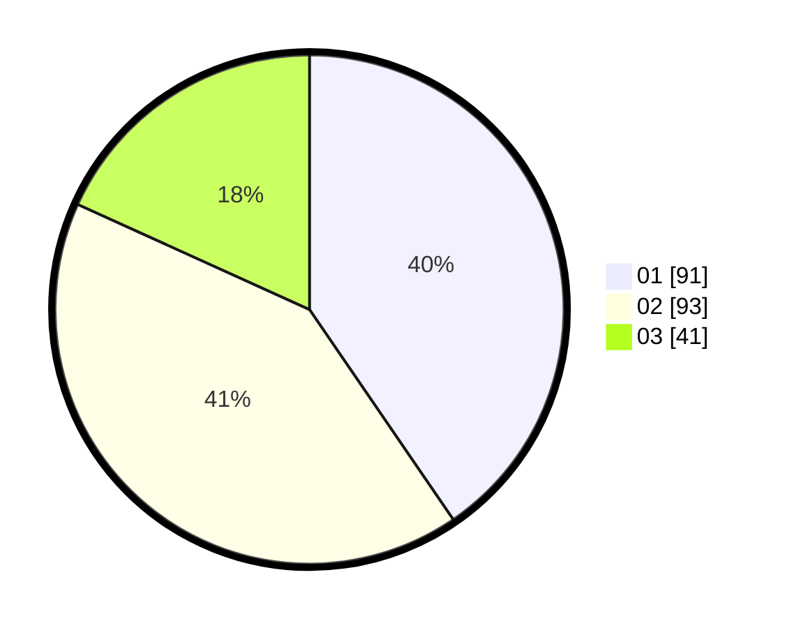

# Hasil

Hasil perolehan suara paslon dapat dilihat pada file paslon-01.txt, paslon-02.txt, dan paslon-03.txt.

Jika tidak ada, artinya data tersebut belum ada pada SIREKAP.

## Perolehan Suara

 * Paslon 01: **91**.
 * Paslon 02: **93**.
 * Paslon 03: **41**.

## Foto C Plano

https://sirekap-obj-formc.kpu.go.id/2bf5/pemilu/ppwp/31/72/03/10/05/3172031005064-20240217-002529--d80cb677-dd9e-4794-b244-69320ac30440.jpg

https://sirekap-obj-formc.kpu.go.id/2bf5/pemilu/ppwp/31/72/03/10/05/3172031005064-20240216-225416--1c179e94-d4fc-4367-8f6e-78c9c50e8bf7.jpg

https://sirekap-obj-formc.kpu.go.id/2bf5/pemilu/ppwp/31/72/03/10/05/3172031005064-20240216-230143--fded860d-7ed7-48c1-b533-57a4d20bd2ca.jpg
