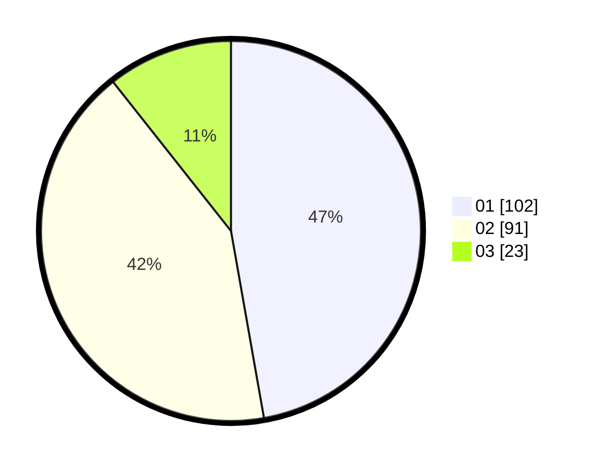

# Hasil

Hasil perolehan suara paslon dapat dilihat pada file paslon-01.txt, paslon-02.txt, dan paslon-03.txt.

Jika tidak ada, artinya data tersebut belum ada pada SIREKAP.

## Perolehan Suara

 * Paslon 01: **102**.
 * Paslon 02: **91**.
 * Paslon 03: **23**.

## Foto C Plano

https://sirekap-obj-formc.kpu.go.id/126c/pemilu/ppwp/31/72/03/10/05/3172031005075-20240214-155128--ec9bf48e-f023-4c89-ae57-a1b049dd3050.jpg

https://sirekap-obj-formc.kpu.go.id/126c/pemilu/ppwp/31/72/03/10/05/3172031005075-20240214-155213--a3558ebe-6aa8-4d83-9297-4ab4f7cb8aed.jpg

https://sirekap-obj-formc.kpu.go.id/126c/pemilu/ppwp/31/72/03/10/05/3172031005075-20240214-155239--c3905411-0a54-4801-9e3c-0e889242ad57.jpg

## DATA PEMILIH TETAP

Jumlah pemilih dalam DPT: **292**.
 * L: **159**.
 * P: **133**.

## DATA PENGGUNA HAK PILIH

Jumlah pengguna hak pilih dalam DPT: **217**.
 * L: **116**.
 * P: **101**.

Jumlah pengguna hak pilih dalam DPTb: **4**.
 * L: **2**.
 * P: **2**.

Jumlah pengguna hak pilih dalam DPK: **0**.
 * L: **0**.
 * P: **0**.

Jumlah pengguna hak pilih: **221**.
 * L: **118**.
 * P: **103**.

## JUMLAH SUARA SAH DAN TIDAK SAH

JUMLAH SELURUH SUARA SAH: **216**.

JUMLAH SUARA TIDAK SAH: **5**.

JUMLAH SELURUH SUARA SAH DAN SUARA TIDAK SAH: **221**.
