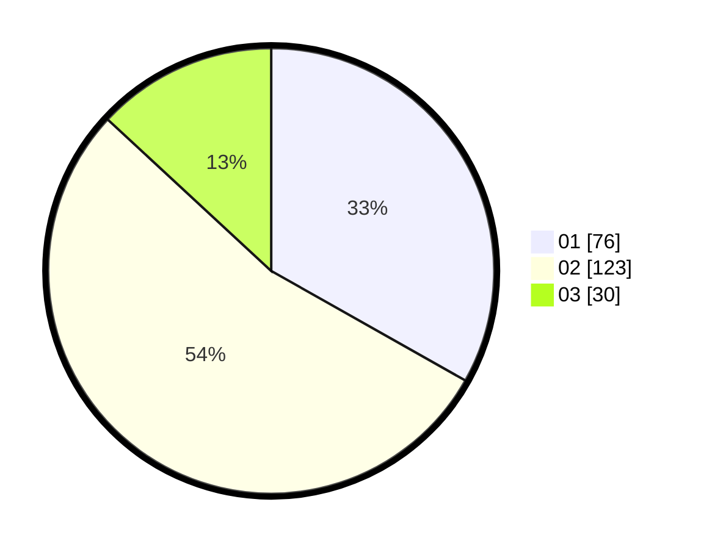

# Hasil

Hasil perolehan suara paslon dapat dilihat pada file paslon-01.txt, paslon-02.txt, dan paslon-03.txt.

Jika tidak ada, artinya data tersebut belum ada pada SIREKAP.

## Perolehan Suara

 * Paslon 01: **76**.
 * Paslon 02: **123**.
 * Paslon 03: **30**.

## Foto C Plano

https://sirekap-obj-formc.kpu.go.id/0410/pemilu/ppwp/31/72/03/10/05/3172031005083-20240214-233415--2281125f-26fa-433d-ba5c-3bf059fba9c7.jpg

https://sirekap-obj-formc.kpu.go.id/0410/pemilu/ppwp/31/72/03/10/05/3172031005083-20240214-233430--0104d68b-c6f7-479d-b439-54b9895d6bc4.jpg

https://sirekap-obj-formc.kpu.go.id/0410/pemilu/ppwp/31/72/03/10/05/3172031005083-20240214-233434--33fa106d-7199-44b4-b0e8-3b60ee48ec1e.jpg

## DATA PEMILIH TETAP

Jumlah pemilih dalam DPT: **291**.
 * L: **137**.
 * P: **154**.

## DATA PENGGUNA HAK PILIH

Jumlah pengguna hak pilih dalam DPT: **229**.
 * L: **106**.
 * P: **123**.

Jumlah pengguna hak pilih dalam DPTb: **0**.
 * L: **0**.
 * P: **0**.

Jumlah pengguna hak pilih dalam DPK: **4**.
 * L: **1**.
 * P: **3**.

Jumlah pengguna hak pilih: **233**.
 * L: **107**.
 * P: **126**.

## JUMLAH SUARA SAH DAN TIDAK SAH

JUMLAH SELURUH SUARA SAH: **229**.

JUMLAH SUARA TIDAK SAH: **4**.

JUMLAH SELURUH SUARA SAH DAN SUARA TIDAK SAH: **233**.
