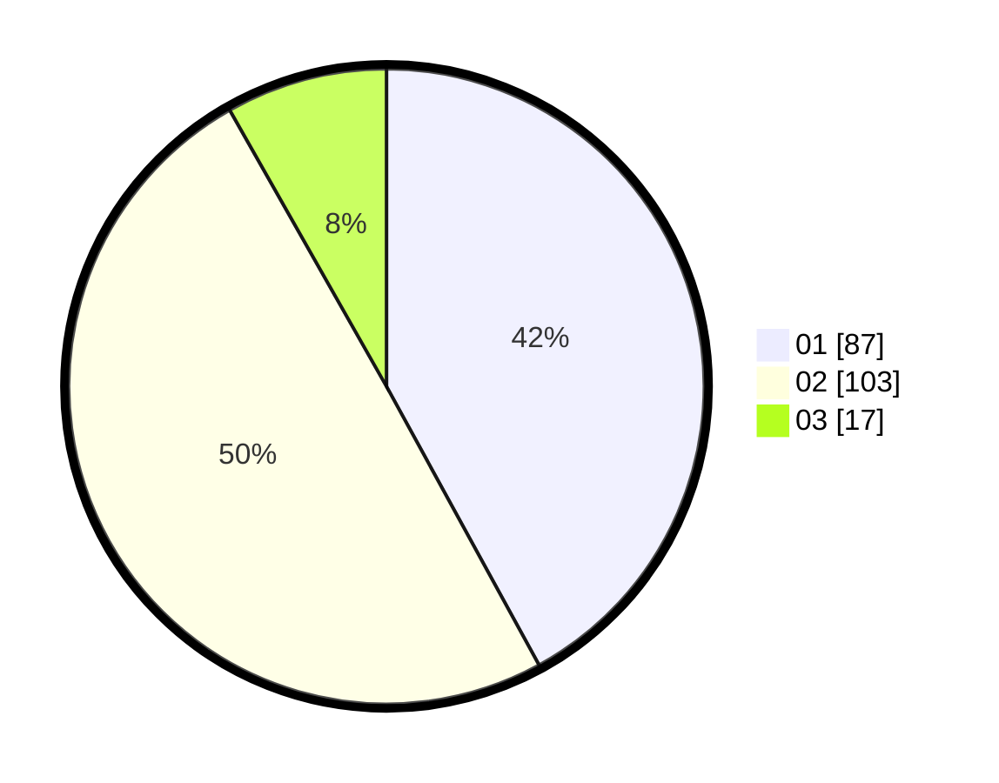

# Hasil

Hasil perolehan suara paslon dapat dilihat pada file paslon-01.txt, paslon-02.txt, dan paslon-03.txt.

Jika tidak ada, artinya data tersebut belum ada pada SIREKAP.

## Perolehan Suara

 * Paslon 01: **87**.
 * Paslon 02: **103**.
 * Paslon 03: **17**.

## Foto C Plano

https://sirekap-obj-formc.kpu.go.id/3637/pemilu/ppwp/31/72/03/10/05/3172031005084-20240214-205755--db3f8df8-e8af-49e2-957a-7511d8a73699.jpg

https://sirekap-obj-formc.kpu.go.id/3637/pemilu/ppwp/31/72/03/10/05/3172031005084-20240214-194649--985f757f-cbea-4257-adbd-72580d7b62d9.jpg

https://sirekap-obj-formc.kpu.go.id/3637/pemilu/ppwp/31/72/03/10/05/3172031005084-20240214-194753--ef86067f-b2f3-486c-b68a-732f6cf175a7.jpg

## DATA PEMILIH TETAP

Jumlah pemilih dalam DPT: **284**.
 * L: **142**.
 * P: **142**.

## DATA PENGGUNA HAK PILIH

Jumlah pengguna hak pilih dalam DPT: **207**.
 * L: **95**.
 * P: **112**.

Jumlah pengguna hak pilih dalam DPTb: **0**.
 * L: **0**.
 * P: **0**.

Jumlah pengguna hak pilih dalam DPK: **0**.
 * L: **0**.
 * P: **0**.

Jumlah pengguna hak pilih: **207**.
 * L: **95**.
 * P: **112**.

## JUMLAH SUARA SAH DAN TIDAK SAH

JUMLAH SELURUH SUARA SAH: **207**.

JUMLAH SUARA TIDAK SAH: **1**.

JUMLAH SELURUH SUARA SAH DAN SUARA TIDAK SAH: **208**.
