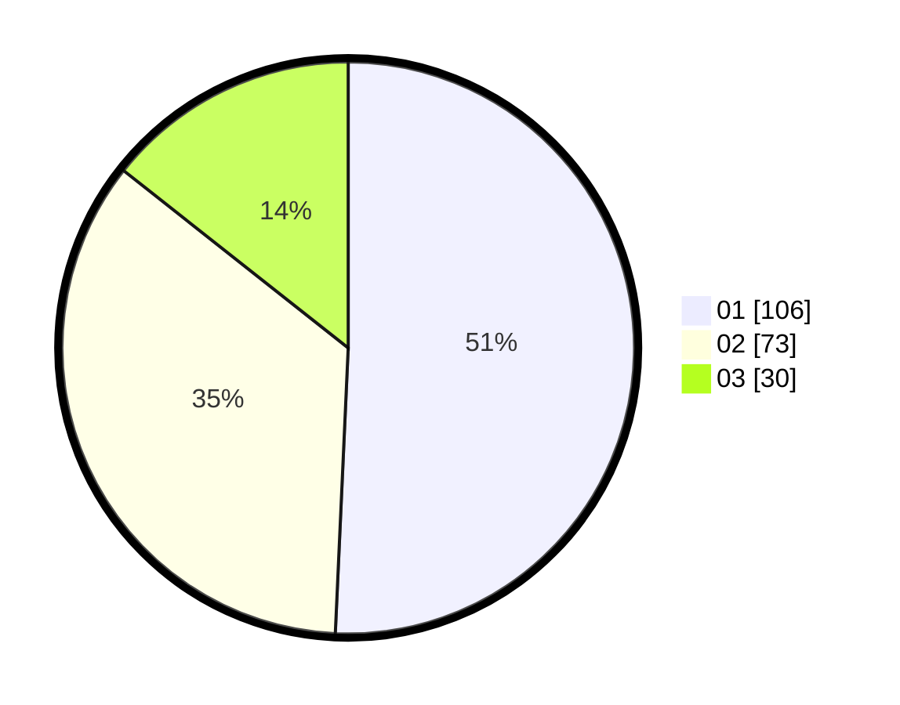

# Hasil

Hasil perolehan suara paslon dapat dilihat pada file paslon-01.txt, paslon-02.txt, dan paslon-03.txt.

Jika tidak ada, artinya data tersebut belum ada pada SIREKAP.

## Perolehan Suara

 * Paslon 01: **106**.
 * Paslon 02: **73**.
 * Paslon 03: **30**.

## Foto C Plano

https://sirekap-obj-formc.kpu.go.id/96d2/pemilu/ppwp/31/72/03/10/05/3172031005086-20240216-180945--ab888547-2827-4515-9741-4b5d2b9e6466.jpg

https://sirekap-obj-formc.kpu.go.id/96d2/pemilu/ppwp/31/72/03/10/05/3172031005086-20240216-191758--5d72a1d9-96fe-433a-8989-09bb4e3e6e31.jpg

https://sirekap-obj-formc.kpu.go.id/96d2/pemilu/ppwp/31/72/03/10/05/3172031005086-20240216-192018--4a90aa01-4e71-47b8-8dcc-9a702952d676.jpg

## DATA PEMILIH TETAP

Jumlah pemilih dalam DPT: **291**.
 * L: **142**.
 * P: **149**.

## DATA PENGGUNA HAK PILIH

Jumlah pengguna hak pilih dalam DPT: **215**.
 * L: **104**.
 * P: **111**.

Jumlah pengguna hak pilih dalam DPTb: **0**.
 * L: **0**.
 * P: **0**.

Jumlah pengguna hak pilih dalam DPK: **4**.
 * L: **2**.
 * P: **2**.

Jumlah pengguna hak pilih: **219**.
 * L: **106**.
 * P: **113**.

## JUMLAH SUARA SAH DAN TIDAK SAH

JUMLAH SELURUH SUARA SAH: **209**.

JUMLAH SUARA TIDAK SAH: **10**.

JUMLAH SELURUH SUARA SAH DAN SUARA TIDAK SAH: **219**.
