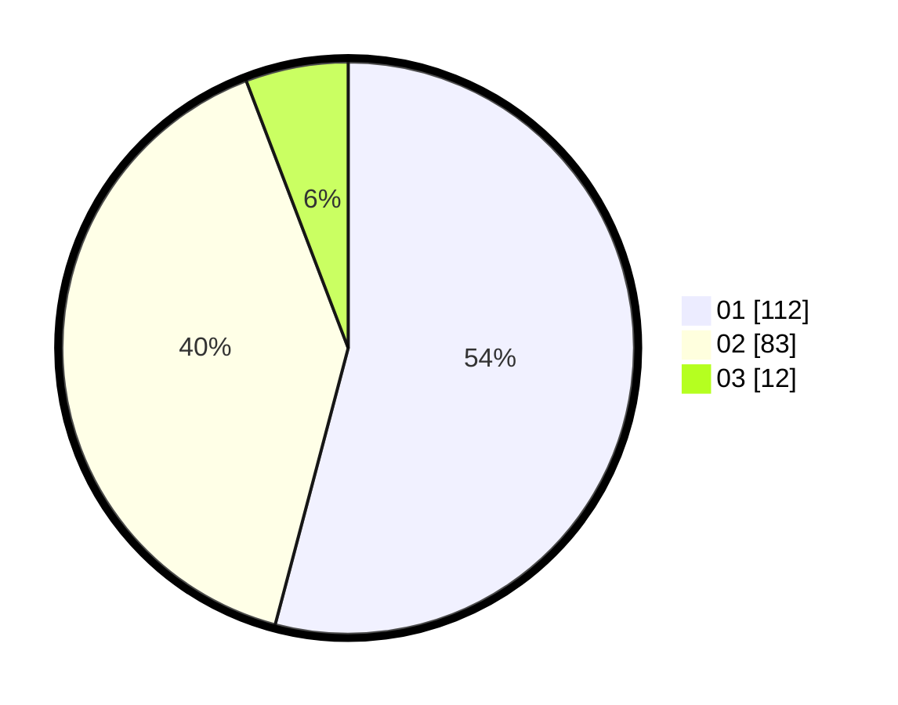

# Hasil

Hasil perolehan suara paslon dapat dilihat pada file paslon-01.txt, paslon-02.txt, dan paslon-03.txt.

Jika tidak ada, artinya data tersebut belum ada pada SIREKAP.

## Perolehan Suara

 * Paslon 01: **112**.
 * Paslon 02: **83**.
 * Paslon 03: **12**.

## Foto C Plano

https://sirekap-obj-formc.kpu.go.id/a598/pemilu/ppwp/31/72/03/10/05/3172031005087-20240216-135537--c73ebead-f86d-4ff2-81ff-977d6c40df31.jpg

https://sirekap-obj-formc.kpu.go.id/a598/pemilu/ppwp/31/72/03/10/05/3172031005087-20240216-135539--8727c29d-169b-4ae9-96a5-f0b0c05382ad.jpg

https://sirekap-obj-formc.kpu.go.id/a598/pemilu/ppwp/31/72/03/10/05/3172031005087-20240216-135538--5eb147d1-a433-426a-9b8a-7684b17fa7df.jpg

## DATA PEMILIH TETAP

Jumlah pemilih dalam DPT: **278**.
 * L: **137**.
 * P: **141**.

## DATA PENGGUNA HAK PILIH

Jumlah pengguna hak pilih dalam DPT: **205**.
 * L: **96**.
 * P: **109**.

Jumlah pengguna hak pilih dalam DPTb: **0**.
 * L: **0**.
 * P: **0**.

Jumlah pengguna hak pilih dalam DPK: **7**.
 * L: **6**.
 * P: **1**.

Jumlah pengguna hak pilih: **212**.
 * L: **102**.
 * P: **110**.

## JUMLAH SUARA SAH DAN TIDAK SAH

JUMLAH SELURUH SUARA SAH: **207**.

JUMLAH SUARA TIDAK SAH: **5**.

JUMLAH SELURUH SUARA SAH DAN SUARA TIDAK SAH: **212**.
