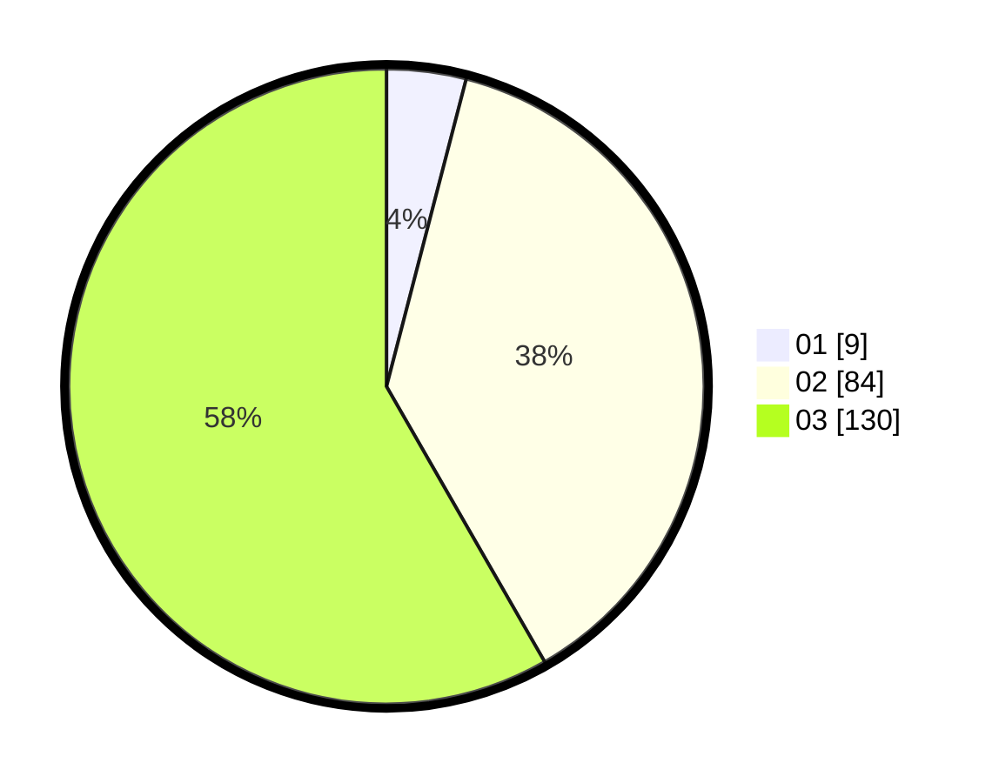

# Hasil

Hasil perolehan suara paslon dapat dilihat pada file paslon-01.txt, paslon-02.txt, dan paslon-03.txt.

Jika tidak ada, artinya data tersebut belum ada pada SIREKAP.

## Perolehan Suara

 * Paslon 01: **9**.
 * Paslon 02: **84**.
 * Paslon 03: **130**.

## Foto C Plano

https://sirekap-obj-formc.kpu.go.id/bf9a/pemilu/ppwp/31/72/03/10/05/3172031005103-20240214-155809--5146ddc1-5d4c-4416-9dd5-b23550d96d9a.jpg

https://sirekap-obj-formc.kpu.go.id/bf9a/pemilu/ppwp/31/72/03/10/05/3172031005103-20240219-110640--49f25ea4-5954-4a8f-8976-7feb15cd61a2.jpg

https://sirekap-obj-formc.kpu.go.id/bf9a/pemilu/ppwp/31/72/03/10/05/3172031005103-20240216-172614--08cb32a5-56dc-4824-903a-79c7b68a1c76.jpg

## DATA PEMILIH TETAP

Jumlah pemilih dalam DPT: **275**.
 * L: **126**.
 * P: **149**.

## DATA PENGGUNA HAK PILIH

Jumlah pengguna hak pilih dalam DPT: **194**.
 * L: **95**.
 * P: **99**.

Jumlah pengguna hak pilih dalam DPTb: **19**.
 * L: **3**.
 * P: **16**.

Jumlah pengguna hak pilih dalam DPK: **11**.
 * L: **4**.
 * P: **7**.

Jumlah pengguna hak pilih: **224**.
 * L: **102**.
 * P: **122**.

## JUMLAH SUARA SAH DAN TIDAK SAH

JUMLAH SELURUH SUARA SAH: **223**.

JUMLAH SUARA TIDAK SAH: **1**.

JUMLAH SELURUH SUARA SAH DAN SUARA TIDAK SAH: **224**.
