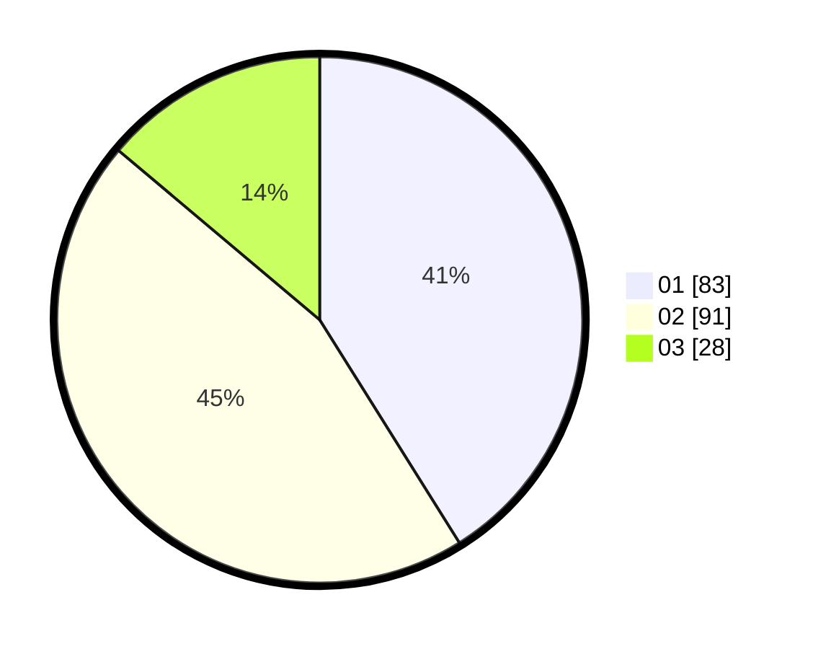

# Hasil

Hasil perolehan suara paslon dapat dilihat pada file paslon-01.txt, paslon-02.txt, dan paslon-03.txt.

Jika tidak ada, artinya data tersebut belum ada pada SIREKAP.

## Perolehan Suara

 * Paslon 01: **83**.
 * Paslon 02: **91**.
 * Paslon 03: **28**.

## Foto C Plano

https://sirekap-obj-formc.kpu.go.id/f7e0/pemilu/ppwp/31/72/03/10/05/3172031005110-20240215-072107--9057259c-a74d-492a-be00-b0a0df083c75.jpg

https://sirekap-obj-formc.kpu.go.id/f7e0/pemilu/ppwp/31/72/03/10/05/3172031005110-20240215-072129--fcf8ec38-6284-445a-9b1c-7da37ecfe873.jpg

https://sirekap-obj-formc.kpu.go.id/f7e0/pemilu/ppwp/31/72/03/10/05/3172031005110-20240215-180233--eb497123-21ea-437a-96fb-7f7b53237eb2.jpg

## DATA PEMILIH TETAP

Jumlah pemilih dalam DPT: **264**.
 * L: **136**.
 * P: **128**.

## DATA PENGGUNA HAK PILIH

Jumlah pengguna hak pilih dalam DPT: **198**.
 * L: **102**.
 * P: **96**.

Jumlah pengguna hak pilih dalam DPTb: **4**.
 * L: **4**.
 * P: **0**.

Jumlah pengguna hak pilih dalam DPK: **2**.
 * L: **1**.
 * P: **1**.

Jumlah pengguna hak pilih: **204**.
 * L: **107**.
 * P: **97**.

## JUMLAH SUARA SAH DAN TIDAK SAH

JUMLAH SELURUH SUARA SAH: **202**.

JUMLAH SUARA TIDAK SAH: **2**.

JUMLAH SELURUH SUARA SAH DAN SUARA TIDAK SAH: **204**.
