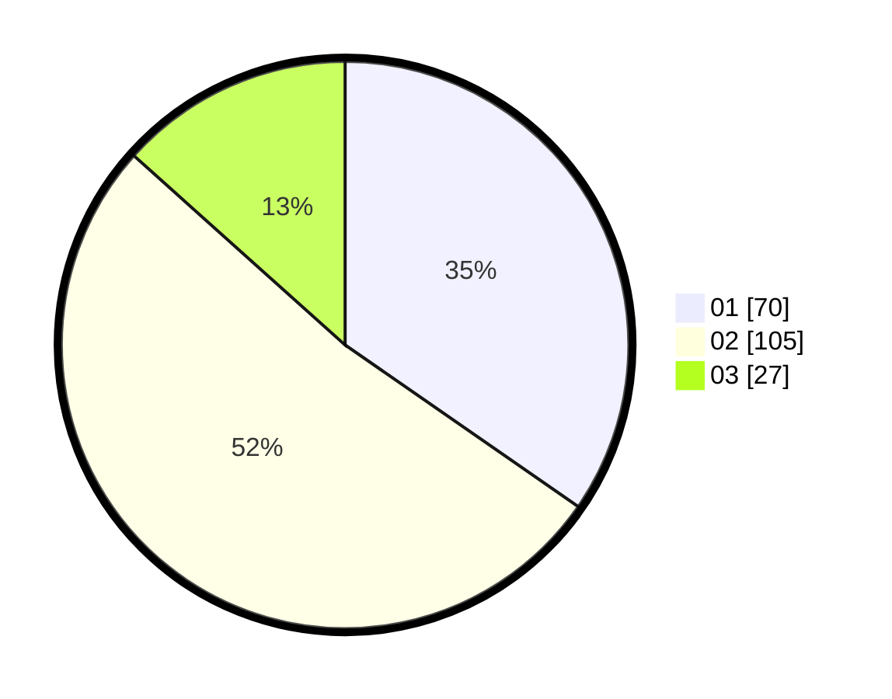

# Hasil

Hasil perolehan suara paslon dapat dilihat pada file paslon-01.txt, paslon-02.txt, dan paslon-03.txt.

Jika tidak ada, artinya data tersebut belum ada pada SIREKAP.

## Perolehan Suara

 * Paslon 01: **70**.
 * Paslon 02: **105**.
 * Paslon 03: **27**.

## Foto C Plano

https://sirekap-obj-formc.kpu.go.id/62d6/pemilu/ppwp/31/72/03/10/05/3172031005120-20240216-173551--50d19e40-1912-4ff0-8f53-d7c7b3b33cd2.jpg

https://sirekap-obj-formc.kpu.go.id/62d6/pemilu/ppwp/31/72/03/10/05/3172031005120-20240216-173552--c1865db3-7bac-454a-9632-09a5788b10d5.jpg

https://sirekap-obj-formc.kpu.go.id/62d6/pemilu/ppwp/31/72/03/10/05/3172031005120-20240216-173551--133b3e65-5a21-4264-89f4-91c27c61a781.jpg

## DATA PEMILIH TETAP

Jumlah pemilih dalam DPT: **252**.
 * L: **127**.
 * P: **125**.

## DATA PENGGUNA HAK PILIH

Jumlah pengguna hak pilih dalam DPT: **191**.
 * L: **88**.
 * P: **103**.

Jumlah pengguna hak pilih dalam DPTb: **7**.
 * L: **3**.
 * P: **4**.

Jumlah pengguna hak pilih dalam DPK: **5**.
 * L: **3**.
 * P: **2**.

Jumlah pengguna hak pilih: **203**.
 * L: **94**.
 * P: **109**.

## JUMLAH SUARA SAH DAN TIDAK SAH

JUMLAH SELURUH SUARA SAH: **202**.

JUMLAH SUARA TIDAK SAH: **1**.

JUMLAH SELURUH SUARA SAH DAN SUARA TIDAK SAH: **203**.
