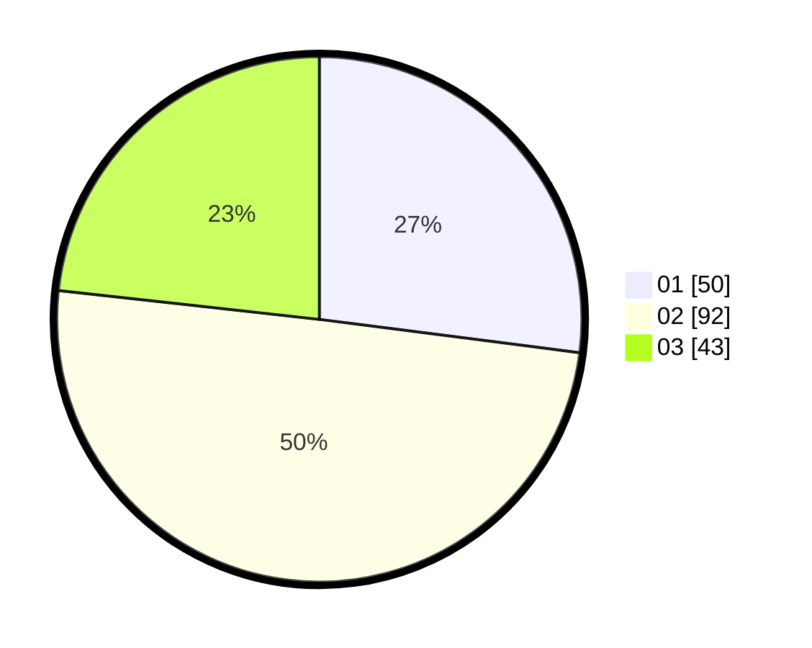

# Hasil

Hasil perolehan suara paslon dapat dilihat pada file paslon-01.txt, paslon-02.txt, dan paslon-03.txt.

Jika tidak ada, artinya data tersebut belum ada pada SIREKAP.

## Perolehan Suara

 * Paslon 01: **50**.
 * Paslon 02: **92**.
 * Paslon 03: **43**.

## Foto C Plano

https://sirekap-obj-formc.kpu.go.id/952c/pemilu/ppwp/31/72/03/10/05/3172031005121-20240215-002848--4da064a5-3397-467c-aa8c-4b70bac5744d.jpg

https://sirekap-obj-formc.kpu.go.id/952c/pemilu/ppwp/31/72/03/10/05/3172031005121-20240215-003519--74a3e69e-d433-4cc4-a410-6c89d77791fb.jpg

https://sirekap-obj-formc.kpu.go.id/952c/pemilu/ppwp/31/72/03/10/05/3172031005121-20240215-003432--712cfaf0-1821-47c9-9d9a-cc91d63a1803.jpg

## DATA PEMILIH TETAP

Jumlah pemilih dalam DPT: **289**.
 * L: **144**.
 * P: **145**.

## DATA PENGGUNA HAK PILIH

Jumlah pengguna hak pilih dalam DPT: **195**.
 * L: **87**.
 * P: **102**.

Jumlah pengguna hak pilih dalam DPTb: **195**.
 * L: **87**.
 * P: **102**.

Jumlah pengguna hak pilih dalam DPK: **3**.
 * L: **1**.
 * P: **2**.

Jumlah pengguna hak pilih: **192**.
 * L: **0**.
 * P: **0**.

## JUMLAH SUARA SAH DAN TIDAK SAH

JUMLAH SELURUH SUARA SAH: **185**.

JUMLAH SUARA TIDAK SAH: **7**.

JUMLAH SELURUH SUARA SAH DAN SUARA TIDAK SAH: **192**.
