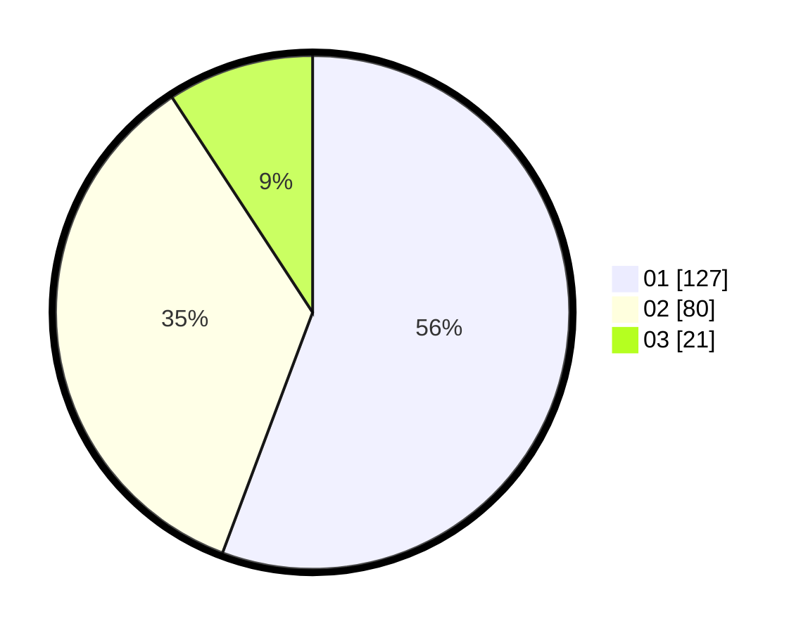

# Hasil

Hasil perolehan suara paslon dapat dilihat pada file paslon-01.txt, paslon-02.txt, dan paslon-03.txt.

Jika tidak ada, artinya data tersebut belum ada pada SIREKAP.

## Perolehan Suara

 * Paslon 01: **127**.
 * Paslon 02: **80**.
 * Paslon 03: **21**.

## Foto C Plano

https://sirekap-obj-formc.kpu.go.id/7744/pemilu/ppwp/31/72/03/10/06/3172031006005-20240214-204859--4952da67-7ff3-4936-a32a-ab3d9f72587c.jpg

https://sirekap-obj-formc.kpu.go.id/7744/pemilu/ppwp/31/72/03/10/06/3172031006005-20240214-205202--4ed090ad-500d-4918-a191-49ea7083b183.jpg

https://sirekap-obj-formc.kpu.go.id/7744/pemilu/ppwp/31/72/03/10/06/3172031006005-20240214-205339--cbfd1ad9-11c8-4481-b3f7-1bf50b54843b.jpg
