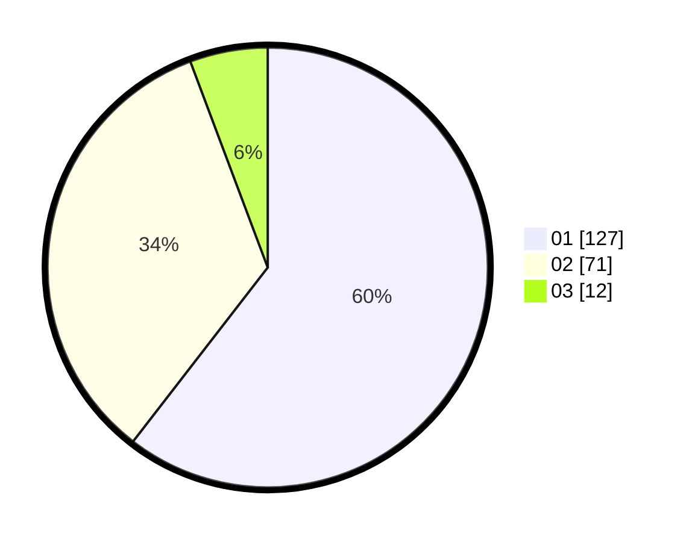

# Hasil

Hasil perolehan suara paslon dapat dilihat pada file paslon-01.txt, paslon-02.txt, dan paslon-03.txt.

Jika tidak ada, artinya data tersebut belum ada pada SIREKAP.

## Perolehan Suara

 * Paslon 01: **127**.
 * Paslon 02: **71**.
 * Paslon 03: **12**.

## Foto C Plano

https://sirekap-obj-formc.kpu.go.id/75e3/pemilu/ppwp/31/72/03/10/06/3172031006020-20240214-192804--4036b8d8-2fbe-49d7-b0a8-703407f74709.jpg

https://sirekap-obj-formc.kpu.go.id/75e3/pemilu/ppwp/31/72/03/10/06/3172031006020-20240214-192812--567d9737-f4fd-4ab5-88ce-8a4c2b73b296.jpg

https://sirekap-obj-formc.kpu.go.id/75e3/pemilu/ppwp/31/72/03/10/06/3172031006020-20240214-192817--9f75e593-082a-4e1f-89a0-561cbec9e276.jpg

## DATA PEMILIH TETAP

Jumlah pemilih dalam DPT: **285**.
 * L: **139**.
 * P: **146**.

## DATA PENGGUNA HAK PILIH

Jumlah pengguna hak pilih dalam DPT: **210**.
 * L: **97**.
 * P: **113**.

Jumlah pengguna hak pilih dalam DPTb: **0**.
 * L: **0**.
 * P: **0**.

Jumlah pengguna hak pilih dalam DPK: **1**.
 * L: **1**.
 * P: **0**.

Jumlah pengguna hak pilih: **211**.
 * L: **98**.
 * P: **113**.

## JUMLAH SUARA SAH DAN TIDAK SAH

JUMLAH SELURUH SUARA SAH: **210**.

JUMLAH SUARA TIDAK SAH: **1**.

JUMLAH SELURUH SUARA SAH DAN SUARA TIDAK SAH: **211**.
