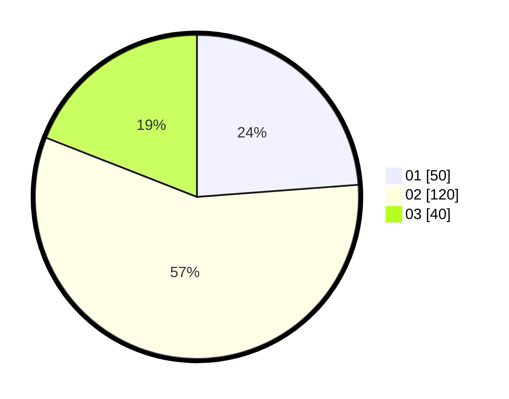

# Hasil

Hasil perolehan suara paslon dapat dilihat pada file paslon-01.txt, paslon-02.txt, dan paslon-03.txt.

Jika tidak ada, artinya data tersebut belum ada pada SIREKAP.

## Perolehan Suara

 * Paslon 01: **50**.
 * Paslon 02: **120**.
 * Paslon 03: **40**.

## Foto C Plano

https://sirekap-obj-formc.kpu.go.id/4f71/pemilu/ppwp/31/72/03/10/06/3172031006023-20240215-021545--09df18ce-97bc-4654-b084-276a8554e74a.jpg

https://sirekap-obj-formc.kpu.go.id/4f71/pemilu/ppwp/31/72/03/10/06/3172031006023-20240214-224642--e7d596eb-ad12-4cab-8a5b-4f01f045bf91.jpg

https://sirekap-obj-formc.kpu.go.id/4f71/pemilu/ppwp/31/72/03/10/06/3172031006023-20240215-021949--a9cb7ba0-7797-433c-ba79-0cc21a594587.jpg
