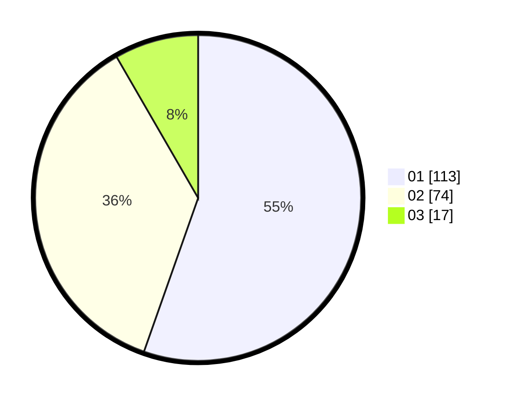

# Hasil

Hasil perolehan suara paslon dapat dilihat pada file paslon-01.txt, paslon-02.txt, dan paslon-03.txt.

Jika tidak ada, artinya data tersebut belum ada pada SIREKAP.

## Perolehan Suara

 * Paslon 01: **113**.
 * Paslon 02: **74**.
 * Paslon 03: **17**.

## Foto C Plano

https://sirekap-obj-formc.kpu.go.id/ebf0/pemilu/ppwp/31/72/03/10/06/3172031006025-20240214-155043--515688ee-c0ca-4750-a519-d3575c5643a6.jpg

https://sirekap-obj-formc.kpu.go.id/ebf0/pemilu/ppwp/31/72/03/10/06/3172031006025-20240214-155831--2f97226c-8167-491a-8333-6e6082c426d7.jpg
