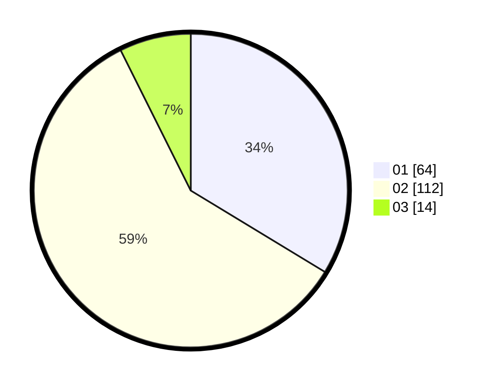

# Hasil

Hasil perolehan suara paslon dapat dilihat pada file paslon-01.txt, paslon-02.txt, dan paslon-03.txt.

Jika tidak ada, artinya data tersebut belum ada pada SIREKAP.

## Perolehan Suara

 * Paslon 01: **64**.
 * Paslon 02: **112**.
 * Paslon 03: **14**.

## Foto C Plano

https://sirekap-obj-formc.kpu.go.id/ac2e/pemilu/ppwp/31/72/03/10/06/3172031006034-20240214-192953--7961052b-b560-46b4-ae55-05189de66325.jpg

https://sirekap-obj-formc.kpu.go.id/ac2e/pemilu/ppwp/31/72/03/10/06/3172031006034-20240214-193034--c34f59cd-70bd-4855-829a-9952ea3ce190.jpg

https://sirekap-obj-formc.kpu.go.id/ac2e/pemilu/ppwp/31/72/03/10/06/3172031006034-20240214-193110--75b74695-c7b1-4707-9964-2fb76a7ae386.jpg

## DATA PEMILIH TETAP

Jumlah pemilih dalam DPT: **197**.
 * L: **94**.
 * P: **103**.

## DATA PENGGUNA HAK PILIH

Jumlah pengguna hak pilih dalam DPT: **197**.
 * L: **94**.
 * P: **103**.

Jumlah pengguna hak pilih dalam DPTb: **0**.
 * L: **0**.
 * P: **0**.

Jumlah pengguna hak pilih dalam DPK: **0**.
 * L: **0**.
 * P: **0**.

Jumlah pengguna hak pilih: **197**.
 * L: **94**.
 * P: **103**.

## JUMLAH SUARA SAH DAN TIDAK SAH

JUMLAH SELURUH SUARA SAH: **190**.

JUMLAH SUARA TIDAK SAH: **7**.

JUMLAH SELURUH SUARA SAH DAN SUARA TIDAK SAH: **197**.
