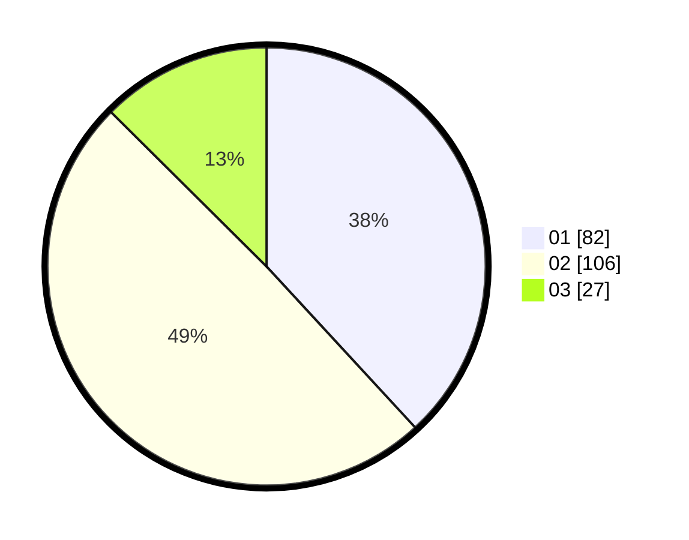

# Hasil

Hasil perolehan suara paslon dapat dilihat pada file paslon-01.txt, paslon-02.txt, dan paslon-03.txt.

Jika tidak ada, artinya data tersebut belum ada pada SIREKAP.

## Perolehan Suara

 * Paslon 01: **82**.
 * Paslon 02: **106**.
 * Paslon 03: **27**.

## Foto C Plano

https://sirekap-obj-formc.kpu.go.id/a895/pemilu/ppwp/31/72/03/10/06/3172031006037-20240215-023208--2250eadb-21c5-4f03-a147-9277661191e7.jpg

https://sirekap-obj-formc.kpu.go.id/a895/pemilu/ppwp/31/72/03/10/06/3172031006037-20240215-023315--fc3fd286-9c6f-4aea-9533-f79ea0f05c87.jpg

https://sirekap-obj-formc.kpu.go.id/a895/pemilu/ppwp/31/72/03/10/06/3172031006037-20240215-023417--f6bda42f-d31b-408c-b325-560bc4ab2d17.jpg
