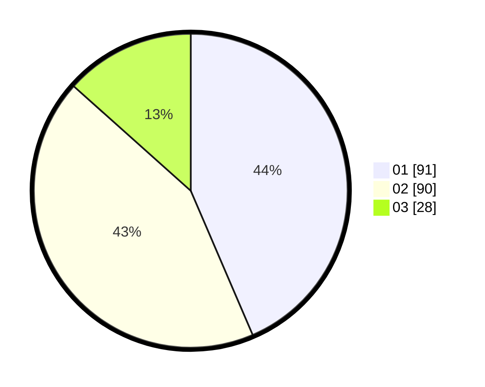

# Hasil

Hasil perolehan suara paslon dapat dilihat pada file paslon-01.txt, paslon-02.txt, dan paslon-03.txt.

Jika tidak ada, artinya data tersebut belum ada pada SIREKAP.

## Perolehan Suara

 * Paslon 01: **91**.
 * Paslon 02: **90**.
 * Paslon 03: **28**.

## Foto C Plano

https://sirekap-obj-formc.kpu.go.id/3aa3/pemilu/ppwp/31/72/03/10/06/3172031006055-20240216-144211--bdb9a796-3a29-4e2b-8cda-3f12f130140f.jpg

https://sirekap-obj-formc.kpu.go.id/3aa3/pemilu/ppwp/31/72/03/10/06/3172031006055-20240216-144212--952c0a0e-ef20-43dc-97c6-00ad5dd9cdfe.jpg

https://sirekap-obj-formc.kpu.go.id/3aa3/pemilu/ppwp/31/72/03/10/06/3172031006055-20240216-144212--6a5e9dbf-d4ee-4d2c-ac07-343b5d882ce5.jpg

## DATA PEMILIH TETAP

Jumlah pemilih dalam DPT: **291**.
 * L: **143**.
 * P: **148**.

## DATA PENGGUNA HAK PILIH

Jumlah pengguna hak pilih dalam DPT: **212**.
 * L: **98**.
 * P: **114**.

Jumlah pengguna hak pilih dalam DPTb: **0**.
 * L: **0**.
 * P: **0**.

Jumlah pengguna hak pilih dalam DPK: **1**.
 * L: **0**.
 * P: **1**.

Jumlah pengguna hak pilih: **213**.
 * L: **98**.
 * P: **115**.

## JUMLAH SUARA SAH DAN TIDAK SAH

JUMLAH SELURUH SUARA SAH: **209**.

JUMLAH SUARA TIDAK SAH: **4**.

JUMLAH SELURUH SUARA SAH DAN SUARA TIDAK SAH: **213**.
