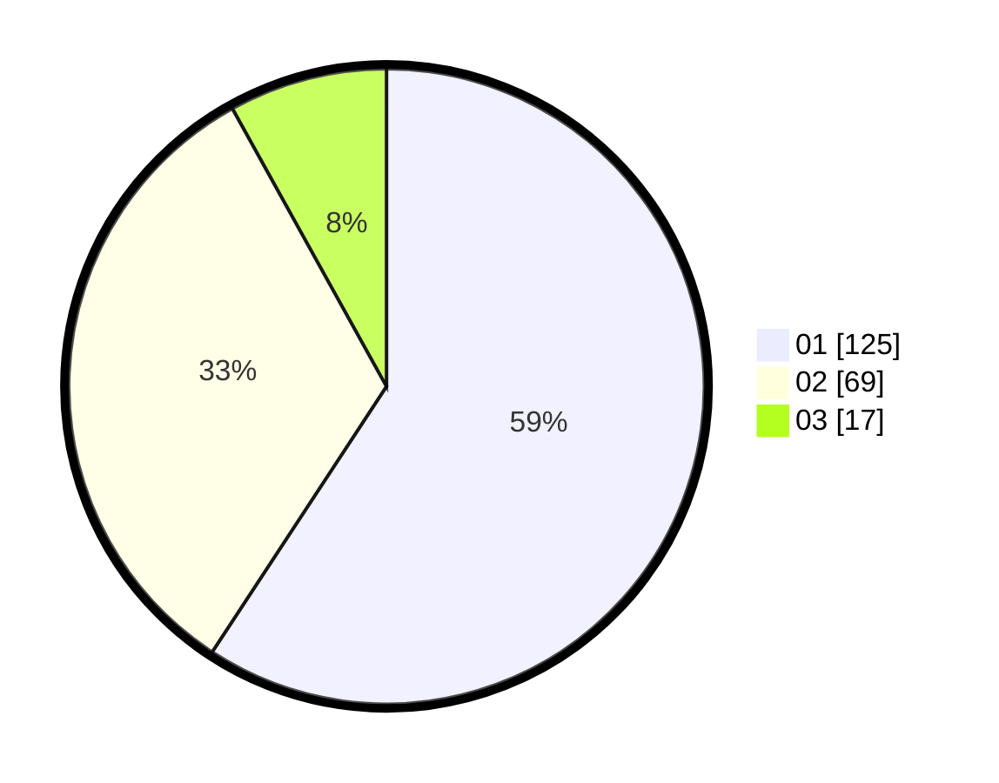

# Hasil

Hasil perolehan suara paslon dapat dilihat pada file paslon-01.txt, paslon-02.txt, dan paslon-03.txt.

Jika tidak ada, artinya data tersebut belum ada pada SIREKAP.

## Perolehan Suara

 * Paslon 01: **125**.
 * Paslon 02: **69**.
 * Paslon 03: **17**.

## Foto C Plano

https://sirekap-obj-formc.kpu.go.id/3391/pemilu/ppwp/31/72/03/10/06/3172031006062-20240214-233430--1e294669-1433-4df8-8435-5c8343261ac1.jpg

https://sirekap-obj-formc.kpu.go.id/3391/pemilu/ppwp/31/72/03/10/06/3172031006062-20240214-235253--c1e5b7d5-9f2b-4cb1-8d9f-562ab505a055.jpg

https://sirekap-obj-formc.kpu.go.id/3391/pemilu/ppwp/31/72/03/10/06/3172031006062-20240214-235744--33fe3d23-e7b0-4253-a768-df6c0cd4f7b0.jpg

## DATA PEMILIH TETAP

Jumlah pemilih dalam DPT: **298**.
 * L: **139**.
 * P: **159**.

## DATA PENGGUNA HAK PILIH

Jumlah pengguna hak pilih dalam DPT: **210**.
 * L: **100**.
 * P: **110**.

Jumlah pengguna hak pilih dalam DPTb: **3**.
 * L: **0**.
 * P: **3**.

Jumlah pengguna hak pilih dalam DPK: **0**.
 * L: **0**.
 * P: **0**.

Jumlah pengguna hak pilih: **213**.
 * L: **100**.
 * P: **113**.

## JUMLAH SUARA SAH DAN TIDAK SAH

JUMLAH SELURUH SUARA SAH: **211**.

JUMLAH SUARA TIDAK SAH: **2**.

JUMLAH SELURUH SUARA SAH DAN SUARA TIDAK SAH: **213**.
