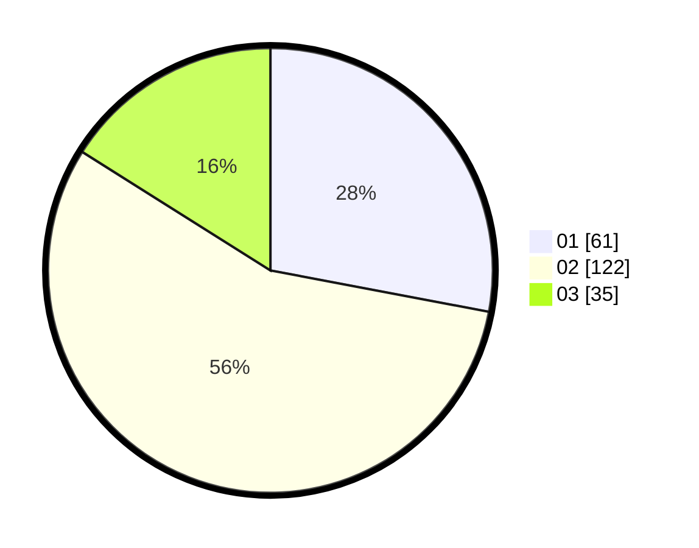

# Hasil

Hasil perolehan suara paslon dapat dilihat pada file paslon-01.txt, paslon-02.txt, dan paslon-03.txt.

Jika tidak ada, artinya data tersebut belum ada pada SIREKAP.

## Perolehan Suara

 * Paslon 01: **61**.
 * Paslon 02: **122**.
 * Paslon 03: **35**.

## Foto C Plano

https://sirekap-obj-formc.kpu.go.id/c131/pemilu/ppwp/31/72/03/10/06/3172031006064-20240216-143933--45a8973d-88b4-42e8-9e05-16c1141bc4a6.jpg

https://sirekap-obj-formc.kpu.go.id/c131/pemilu/ppwp/31/72/03/10/06/3172031006064-20240216-143935--6dc142ad-36fc-4add-a106-a16a8f27da83.jpg

https://sirekap-obj-formc.kpu.go.id/c131/pemilu/ppwp/31/72/03/10/06/3172031006064-20240216-143934--a1bd2bc5-dfd9-4509-bb65-27d6a8b3b4f2.jpg

## DATA PEMILIH TETAP

Jumlah pemilih dalam DPT: **284**.
 * L: **135**.
 * P: **149**.

## DATA PENGGUNA HAK PILIH

Jumlah pengguna hak pilih dalam DPT: **221**.
 * L: **96**.
 * P: **125**.

Jumlah pengguna hak pilih dalam DPTb: **0**.
 * L: **0**.
 * P: **0**.

Jumlah pengguna hak pilih dalam DPK: **2**.
 * L: **0**.
 * P: **2**.

Jumlah pengguna hak pilih: **223**.
 * L: **96**.
 * P: **127**.

## JUMLAH SUARA SAH DAN TIDAK SAH

JUMLAH SELURUH SUARA SAH: **218**.

JUMLAH SUARA TIDAK SAH: **5**.

JUMLAH SELURUH SUARA SAH DAN SUARA TIDAK SAH: **223**.
