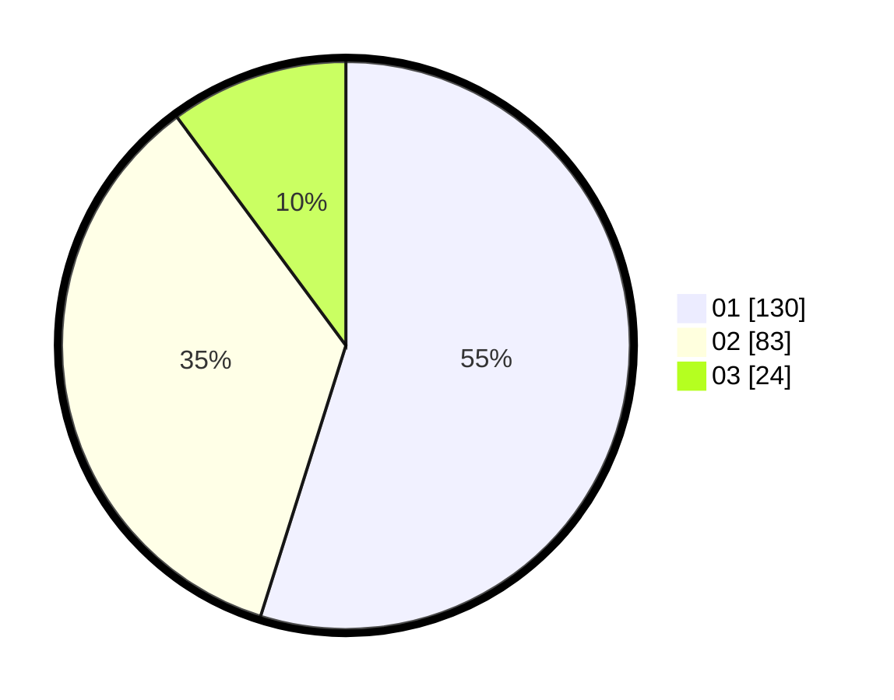

# Hasil

Hasil perolehan suara paslon dapat dilihat pada file paslon-01.txt, paslon-02.txt, dan paslon-03.txt.

Jika tidak ada, artinya data tersebut belum ada pada SIREKAP.

## Perolehan Suara

 * Paslon 01: **130**.
 * Paslon 02: **83**.
 * Paslon 03: **24**.

## Foto C Plano

https://sirekap-obj-formc.kpu.go.id/5931/pemilu/ppwp/31/72/03/10/06/3172031006082-20240214-214447--7dd64927-972e-43cf-ac6f-3481a77c05d3.jpg

https://sirekap-obj-formc.kpu.go.id/5931/pemilu/ppwp/31/72/03/10/06/3172031006082-20240214-214642--c8a3e2a5-c452-4f78-b98e-81667d6956cf.jpg

https://sirekap-obj-formc.kpu.go.id/5931/pemilu/ppwp/31/72/03/10/06/3172031006082-20240214-215911--d64a11fc-1bfc-462e-84d4-82020be5504b.jpg
