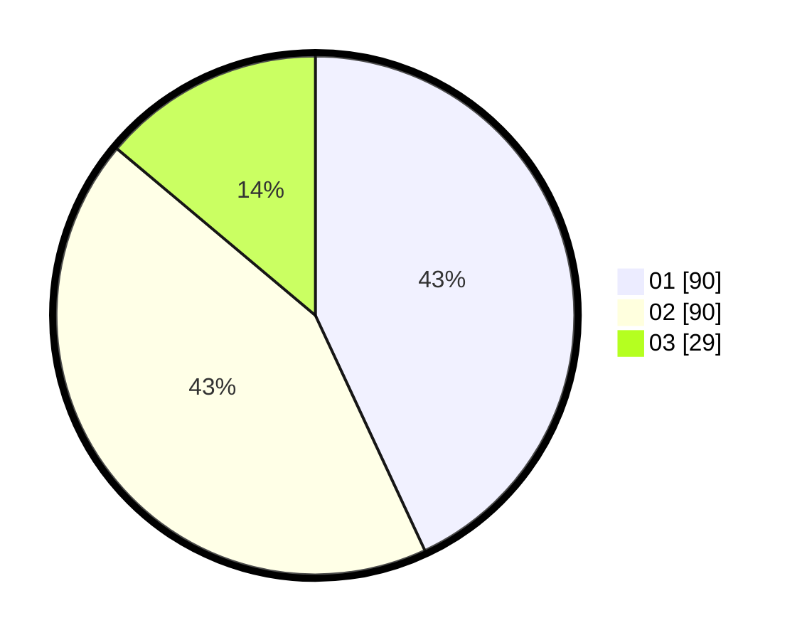

# Hasil

Hasil perolehan suara paslon dapat dilihat pada file paslon-01.txt, paslon-02.txt, dan paslon-03.txt.

Jika tidak ada, artinya data tersebut belum ada pada SIREKAP.

## Perolehan Suara

 * Paslon 01: **90**.
 * Paslon 02: **90**.
 * Paslon 03: **29**.

## Foto C Plano

https://sirekap-obj-formc.kpu.go.id/7103/pemilu/ppwp/31/72/03/10/06/3172031006085-20240214-221642--289244be-93da-4275-8345-cd141acb4db7.jpg

https://sirekap-obj-formc.kpu.go.id/7103/pemilu/ppwp/31/72/03/10/06/3172031006085-20240214-221738--e68afb1b-03f3-453e-9b9d-9e07ed38be80.jpg

https://sirekap-obj-formc.kpu.go.id/7103/pemilu/ppwp/31/72/03/10/06/3172031006085-20240214-221836--7a0ad33c-b897-4d7b-8cfe-84612c08a357.jpg
