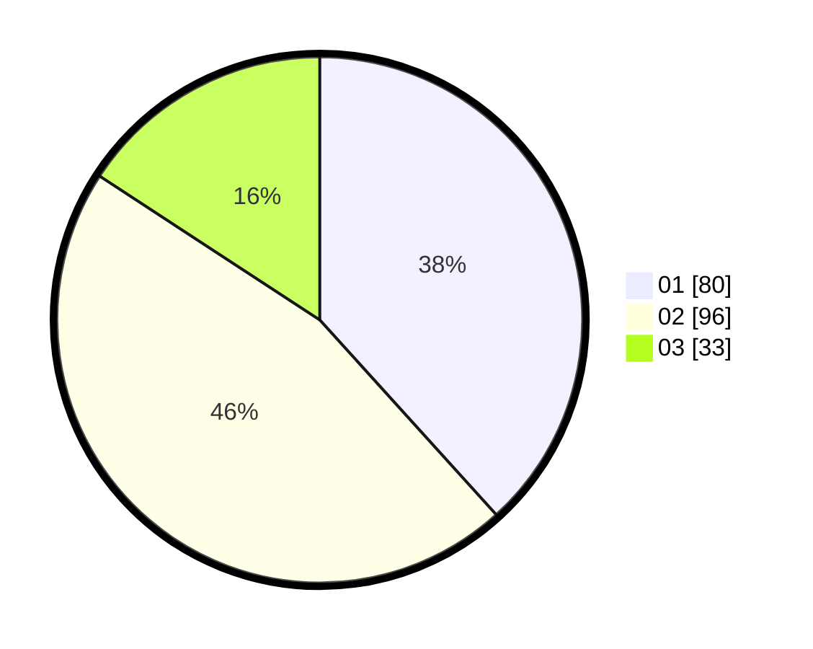

# Hasil

Hasil perolehan suara paslon dapat dilihat pada file paslon-01.txt, paslon-02.txt, dan paslon-03.txt.

Jika tidak ada, artinya data tersebut belum ada pada SIREKAP.

## Perolehan Suara

 * Paslon 01: **80**.
 * Paslon 02: **96**.
 * Paslon 03: **33**.

## Foto C Plano

https://sirekap-obj-formc.kpu.go.id/a46b/pemilu/ppwp/31/72/03/10/06/3172031006089-20240216-170955--820fa43a-aaaf-41d9-8a15-35d29344402c.jpg

https://sirekap-obj-formc.kpu.go.id/a46b/pemilu/ppwp/31/72/03/10/06/3172031006089-20240216-170542--0c66677f-1159-46ff-a155-28926c79208b.jpg

https://sirekap-obj-formc.kpu.go.id/a46b/pemilu/ppwp/31/72/03/10/06/3172031006089-20240216-172042--33aa664b-0e3e-48bb-a404-399c9559fa94.jpg
