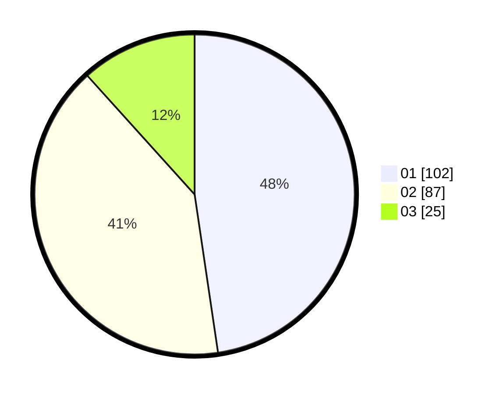

# Hasil

Hasil perolehan suara paslon dapat dilihat pada file paslon-01.txt, paslon-02.txt, dan paslon-03.txt.

Jika tidak ada, artinya data tersebut belum ada pada SIREKAP.

## Perolehan Suara

 * Paslon 01: **102**.
 * Paslon 02: **87**.
 * Paslon 03: **25**.

## Foto C Plano

https://sirekap-obj-formc.kpu.go.id/3733/pemilu/ppwp/31/72/03/10/06/3172031006091-20240216-035438--6e7b179c-26c0-4774-9c4a-061c9217d5e0.jpg

https://sirekap-obj-formc.kpu.go.id/3733/pemilu/ppwp/31/72/03/10/06/3172031006091-20240216-040154--8d1e8af4-68ec-4dd8-b927-18fc3d083c83.jpg

https://sirekap-obj-formc.kpu.go.id/3733/pemilu/ppwp/31/72/03/10/06/3172031006091-20240216-035446--db6f620f-01b2-4aa2-9b31-637f1efc76b8.jpg

## DATA PEMILIH TETAP

Jumlah pemilih dalam DPT: **287**.
 * L: **143**.
 * P: **144**.

## DATA PENGGUNA HAK PILIH

Jumlah pengguna hak pilih dalam DPT: **213**.
 * L: **102**.
 * P: **101**.

Jumlah pengguna hak pilih dalam DPTb: **1**.
 * L: **0**.
 * P: **1**.

Jumlah pengguna hak pilih dalam DPK: **5**.
 * L: **2**.
 * P: **3**.

Jumlah pengguna hak pilih: **219**.
 * L: **104**.
 * P: **115**.

## JUMLAH SUARA SAH DAN TIDAK SAH

JUMLAH SELURUH SUARA SAH: **214**.

JUMLAH SUARA TIDAK SAH: **5**.

JUMLAH SELURUH SUARA SAH DAN SUARA TIDAK SAH: **219**.
