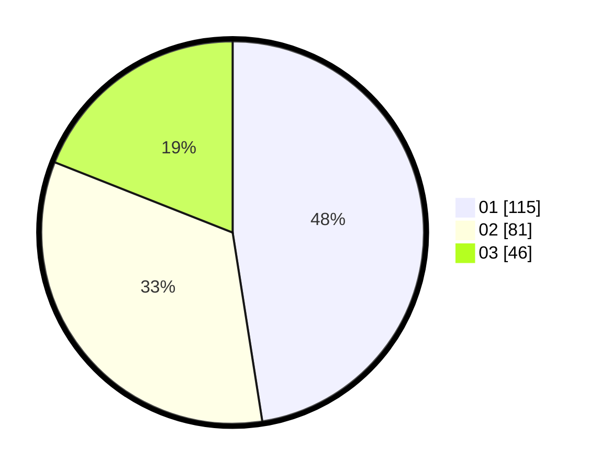

# Hasil

Hasil perolehan suara paslon dapat dilihat pada file paslon-01.txt, paslon-02.txt, dan paslon-03.txt.

Jika tidak ada, artinya data tersebut belum ada pada SIREKAP.

## Perolehan Suara

 * Paslon 01: **115**.
 * Paslon 02: **81**.
 * Paslon 03: **46**.

## Foto C Plano

https://sirekap-obj-formc.kpu.go.id/884f/pemilu/ppwp/31/72/03/10/06/3172031006102-20240216-004210--d6a886cc-d0c7-4a51-9ae5-20a91be98ac6.jpg

https://sirekap-obj-formc.kpu.go.id/884f/pemilu/ppwp/31/72/03/10/06/3172031006102-20240214-211024--e13c8116-b2ea-4e6f-9d48-ad0a82592f83.jpg

https://sirekap-obj-formc.kpu.go.id/884f/pemilu/ppwp/31/72/03/10/06/3172031006102-20240216-004034--91ff79e9-322a-4ed4-a801-afaba604f6ad.jpg

## DATA PEMILIH TETAP

Jumlah pemilih dalam DPT: **272**.
 * L: **126**.
 * P: **146**.

## DATA PENGGUNA HAK PILIH

Jumlah pengguna hak pilih dalam DPT: **233**.
 * L: **102**.
 * P: **131**.

Jumlah pengguna hak pilih dalam DPTb: **6**.
 * L: **3**.
 * P: **3**.

Jumlah pengguna hak pilih dalam DPK: **4**.
 * L: **2**.
 * P: **2**.

Jumlah pengguna hak pilih: **243**.
 * L: **107**.
 * P: **136**.

## JUMLAH SUARA SAH DAN TIDAK SAH

JUMLAH SELURUH SUARA SAH: **242**.

JUMLAH SUARA TIDAK SAH: **1**.

JUMLAH SELURUH SUARA SAH DAN SUARA TIDAK SAH: **243**.
