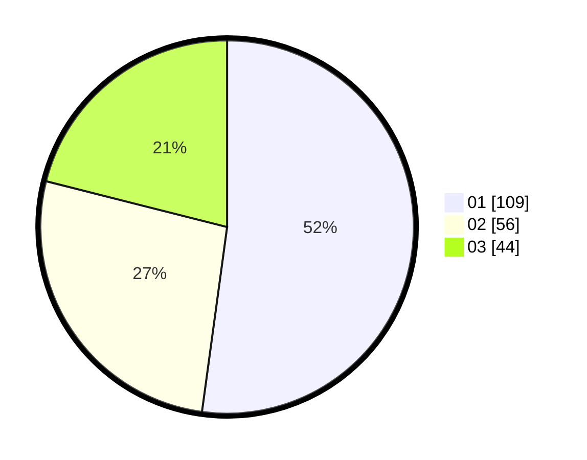

# Hasil

Hasil perolehan suara paslon dapat dilihat pada file paslon-01.txt, paslon-02.txt, dan paslon-03.txt.

Jika tidak ada, artinya data tersebut belum ada pada SIREKAP.

## Perolehan Suara

 * Paslon 01: **109**.
 * Paslon 02: **56**.
 * Paslon 03: **44**.

## Foto C Plano

https://sirekap-obj-formc.kpu.go.id/11ba/pemilu/ppwp/31/72/03/10/06/3172031006106-20240214-225419--11db6795-b17b-42d8-ad52-53d18b9db7f9.jpg

https://sirekap-obj-formc.kpu.go.id/11ba/pemilu/ppwp/31/72/03/10/06/3172031006106-20240214-210229--c6649e3c-692c-42d9-9b54-b4eeb0626184.jpg

https://sirekap-obj-formc.kpu.go.id/11ba/pemilu/ppwp/31/72/03/10/06/3172031006106-20240214-225612--41ddd243-539d-4a57-947e-5786866e03b6.jpg
