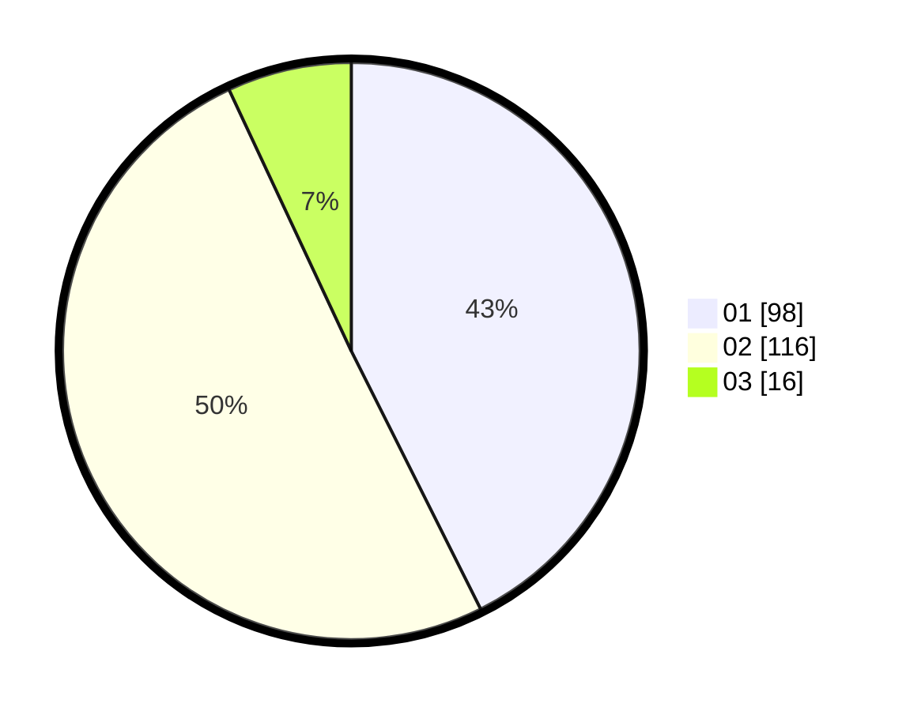

# Hasil

Hasil perolehan suara paslon dapat dilihat pada file paslon-01.txt, paslon-02.txt, dan paslon-03.txt.

Jika tidak ada, artinya data tersebut belum ada pada SIREKAP.

## Perolehan Suara

 * Paslon 01: **98**.
 * Paslon 02: **116**.
 * Paslon 03: **16**.

## Foto C Plano

https://sirekap-obj-formc.kpu.go.id/0960/pemilu/ppwp/31/72/03/10/06/3172031006109-20240214-191401--ce67edea-5173-4f61-be52-968deb0085c3.jpg

https://sirekap-obj-formc.kpu.go.id/0960/pemilu/ppwp/31/72/03/10/06/3172031006109-20240214-191829--fffc96b6-ca19-441e-9285-faadb5bfdf65.jpg
