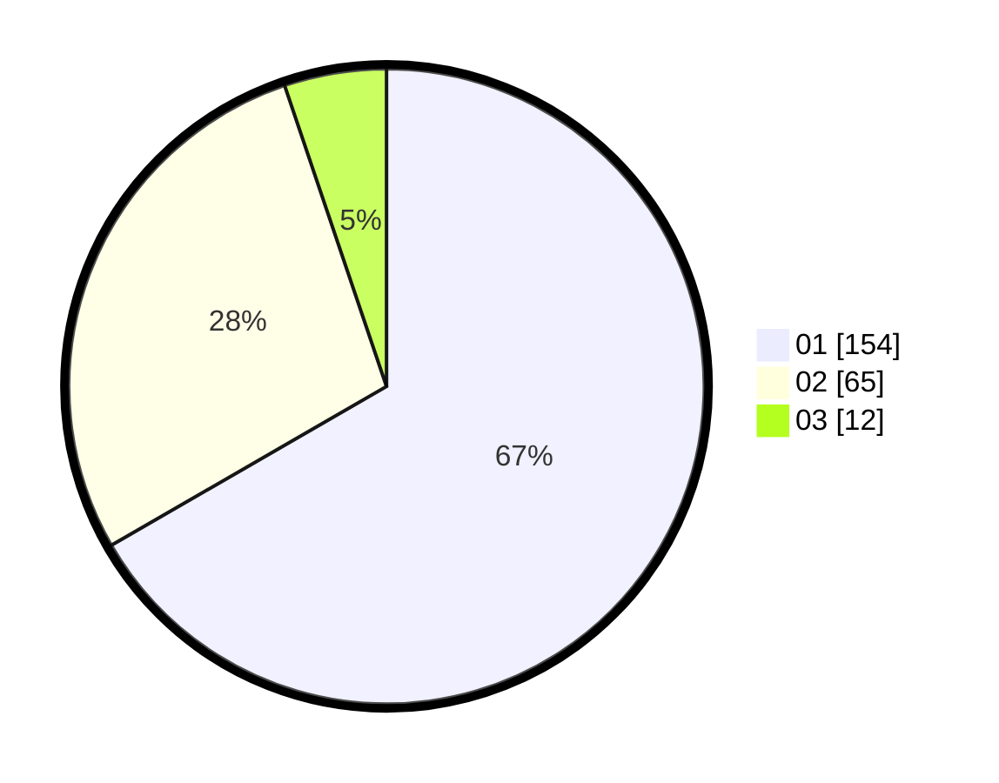

# Hasil

Hasil perolehan suara paslon dapat dilihat pada file paslon-01.txt, paslon-02.txt, dan paslon-03.txt.

Jika tidak ada, artinya data tersebut belum ada pada SIREKAP.

## Perolehan Suara

 * Paslon 01: **154**.
 * Paslon 02: **65**.
 * Paslon 03: **12**.

## Foto C Plano

https://sirekap-obj-formc.kpu.go.id/36a3/pemilu/ppwp/31/72/03/10/06/3172031006113-20240214-162232--6df3f418-c31d-454e-b355-b7d1ffd78a21.jpg

https://sirekap-obj-formc.kpu.go.id/36a3/pemilu/ppwp/31/72/03/10/06/3172031006113-20240214-203431--298ef5d0-32ff-446f-aeed-d9964d028366.jpg

https://sirekap-obj-formc.kpu.go.id/36a3/pemilu/ppwp/31/72/03/10/06/3172031006113-20240214-194702--22f725df-4a34-4c2d-ba56-1e96ada3ec59.jpg

## DATA PEMILIH TETAP

Jumlah pemilih dalam DPT: **291**.
 * L: **136**.
 * P: **155**.

## DATA PENGGUNA HAK PILIH

Jumlah pengguna hak pilih dalam DPT: **230**.
 * L: **106**.
 * P: **124**.

Jumlah pengguna hak pilih dalam DPTb: **2**.
 * L: **1**.
 * P: **1**.

Jumlah pengguna hak pilih dalam DPK: **0**.
 * L: **0**.
 * P: **0**.

Jumlah pengguna hak pilih: **232**.
 * L: **107**.
 * P: **125**.

## JUMLAH SUARA SAH DAN TIDAK SAH

JUMLAH SELURUH SUARA SAH: **231**.

JUMLAH SUARA TIDAK SAH: **1**.

JUMLAH SELURUH SUARA SAH DAN SUARA TIDAK SAH: **232**.
