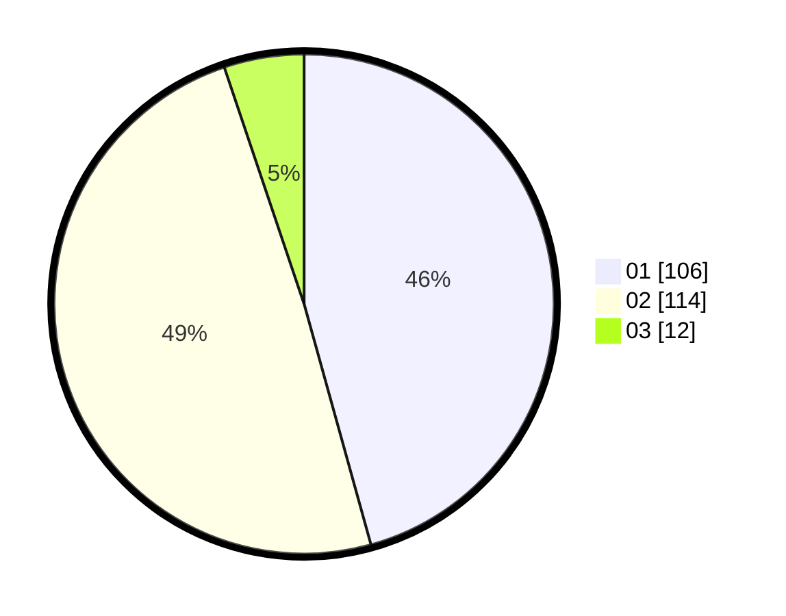

# Hasil

Hasil perolehan suara paslon dapat dilihat pada file paslon-01.txt, paslon-02.txt, dan paslon-03.txt.

Jika tidak ada, artinya data tersebut belum ada pada SIREKAP.

## Perolehan Suara

 * Paslon 01: **106**.
 * Paslon 02: **114**.
 * Paslon 03: **12**.

## Foto C Plano

https://sirekap-obj-formc.kpu.go.id/5f6a/pemilu/ppwp/31/72/03/10/06/3172031006114-20240214-222053--3164df6c-daf1-4cb0-bd27-696740b57504.jpg

https://sirekap-obj-formc.kpu.go.id/5f6a/pemilu/ppwp/31/72/03/10/06/3172031006114-20240214-222238--32f8fc40-fff0-45b7-973c-7e10a732e398.jpg

https://sirekap-obj-formc.kpu.go.id/5f6a/pemilu/ppwp/31/72/03/10/06/3172031006114-20240214-222823--96396a28-01b7-4fde-885a-d7b1dd2b2bd5.jpg
