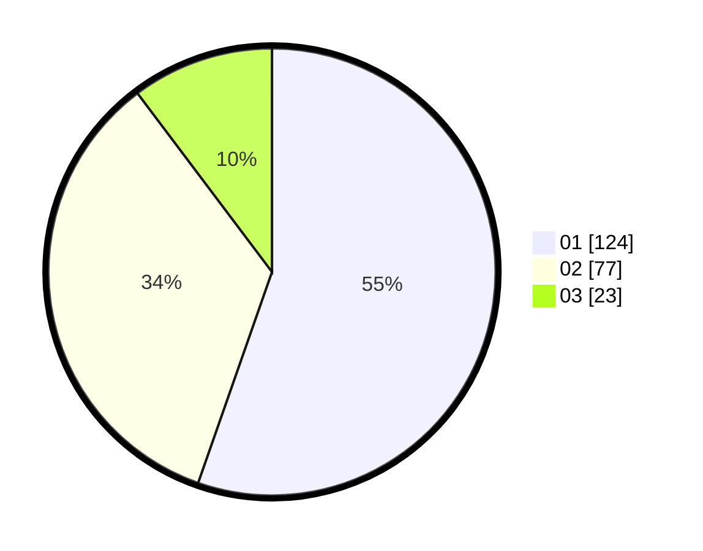

# Hasil

Hasil perolehan suara paslon dapat dilihat pada file paslon-01.txt, paslon-02.txt, dan paslon-03.txt.

Jika tidak ada, artinya data tersebut belum ada pada SIREKAP.

## Perolehan Suara

 * Paslon 01: **124**.
 * Paslon 02: **77**.
 * Paslon 03: **23**.

## Foto C Plano

https://sirekap-obj-formc.kpu.go.id/4729/pemilu/ppwp/31/72/03/10/06/3172031006118-20240214-210845--9f4ce390-a8f8-444f-be95-81afe0233656.jpg

https://sirekap-obj-formc.kpu.go.id/4729/pemilu/ppwp/31/72/03/10/06/3172031006118-20240214-210916--f458ae98-22fc-4716-8ead-eb0ad75d4b55.jpg

https://sirekap-obj-formc.kpu.go.id/4729/pemilu/ppwp/31/72/03/10/06/3172031006118-20240214-210926--4694f9fd-a010-4678-89f5-3485c0595eb8.jpg

## DATA PEMILIH TETAP

Jumlah pemilih dalam DPT: **288**.
 * L: **142**.
 * P: **146**.

## DATA PENGGUNA HAK PILIH

Jumlah pengguna hak pilih dalam DPT: **214**.
 * L: **102**.
 * P: **112**.

Jumlah pengguna hak pilih dalam DPTb: **0**.
 * L: **0**.
 * P: **0**.

Jumlah pengguna hak pilih dalam DPK: **11**.
 * L: **3**.
 * P: **8**.

Jumlah pengguna hak pilih: **225**.
 * L: **105**.
 * P: **120**.

## JUMLAH SUARA SAH DAN TIDAK SAH

JUMLAH SELURUH SUARA SAH: **224**.

JUMLAH SUARA TIDAK SAH: **1**.

JUMLAH SELURUH SUARA SAH DAN SUARA TIDAK SAH: **225**.
