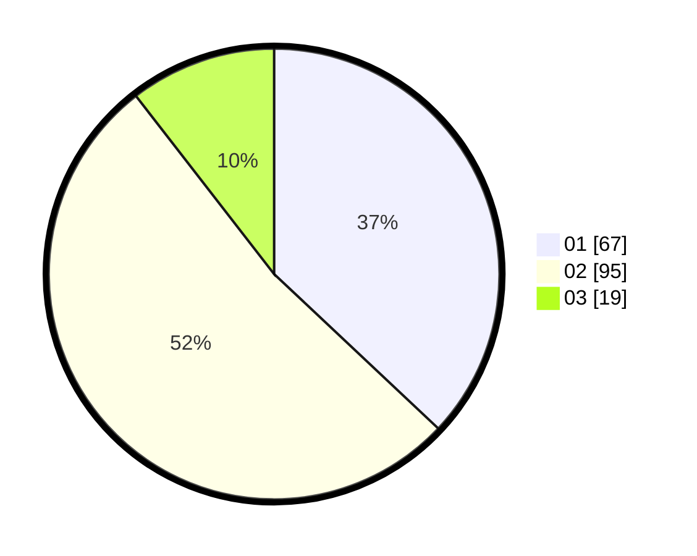

# Hasil

Hasil perolehan suara paslon dapat dilihat pada file paslon-01.txt, paslon-02.txt, dan paslon-03.txt.

Jika tidak ada, artinya data tersebut belum ada pada SIREKAP.

## Perolehan Suara

 * Paslon 01: **67**.
 * Paslon 02: **95**.
 * Paslon 03: **19**.

## Foto C Plano

https://sirekap-obj-formc.kpu.go.id/3242/pemilu/ppwp/31/72/03/10/06/3172031006122-20240214-211013--c4f9c76a-e4a0-479b-9059-283c44de712e.jpg

https://sirekap-obj-formc.kpu.go.id/3242/pemilu/ppwp/31/72/03/10/06/3172031006122-20240214-211600--8c9d3b81-c831-4e77-9b59-351aafb8fe65.jpg

https://sirekap-obj-formc.kpu.go.id/3242/pemilu/ppwp/31/72/03/10/06/3172031006122-20240214-141258--7647cc9f-efc0-41f0-98e8-3b4cb9a04cb1.jpg
