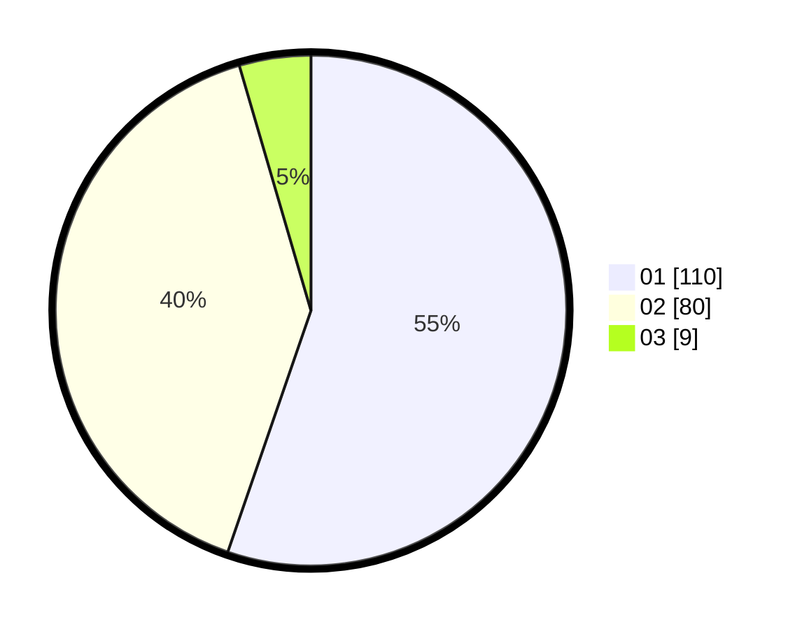

# Hasil

Hasil perolehan suara paslon dapat dilihat pada file paslon-01.txt, paslon-02.txt, dan paslon-03.txt.

Jika tidak ada, artinya data tersebut belum ada pada SIREKAP.

## Perolehan Suara

 * Paslon 01: **110**.
 * Paslon 02: **80**.
 * Paslon 03: **9**.

## Foto C Plano

https://sirekap-obj-formc.kpu.go.id/b087/pemilu/ppwp/31/72/03/10/06/3172031006132-20240214-205514--ca50dd49-b7fb-4b98-9493-34e5c31e0729.jpg

https://sirekap-obj-formc.kpu.go.id/b087/pemilu/ppwp/31/72/03/10/06/3172031006132-20240214-225913--ab78798a-6e57-40a7-99dc-fc6cfce3b04a.jpg

https://sirekap-obj-formc.kpu.go.id/b087/pemilu/ppwp/31/72/03/10/06/3172031006132-20240214-205523--d5f9a510-ad75-4b6b-b1c4-1b48e0f49230.jpg

## DATA PEMILIH TETAP

Jumlah pemilih dalam DPT: **288**.
 * L: **154**.
 * P: **134**.

## DATA PENGGUNA HAK PILIH

Jumlah pengguna hak pilih dalam DPT: **200**.
 * L: **104**.
 * P: **96**.

Jumlah pengguna hak pilih dalam DPTb: **0**.
 * L: **0**.
 * P: **0**.

Jumlah pengguna hak pilih dalam DPK: **6**.
 * L: **4**.
 * P: **2**.

Jumlah pengguna hak pilih: **206**.
 * L: **108**.
 * P: **98**.

## JUMLAH SUARA SAH DAN TIDAK SAH

JUMLAH SELURUH SUARA SAH: **199**.

JUMLAH SUARA TIDAK SAH: **7**.

JUMLAH SELURUH SUARA SAH DAN SUARA TIDAK SAH: **206**.
