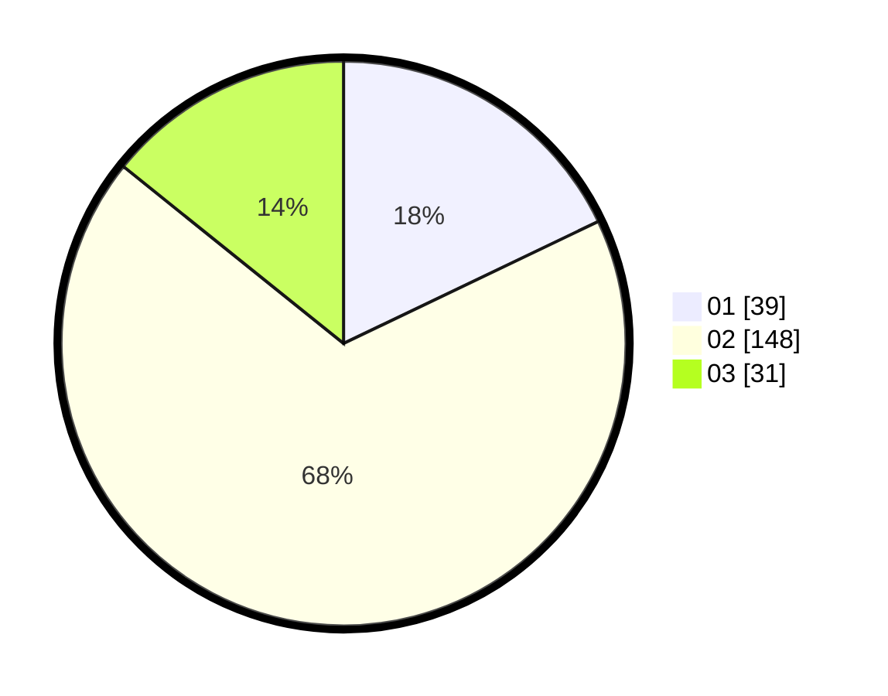

# Hasil

Hasil perolehan suara paslon dapat dilihat pada file paslon-01.txt, paslon-02.txt, dan paslon-03.txt.

Jika tidak ada, artinya data tersebut belum ada pada SIREKAP.

## Perolehan Suara

 * Paslon 01: **39**.
 * Paslon 02: **148**.
 * Paslon 03: **31**.

## Foto C Plano

https://sirekap-obj-formc.kpu.go.id/c2f3/pemilu/ppwp/31/72/03/10/06/3172031006137-20240215-014240--477d0583-23c2-4b1a-aa07-cc77292e911d.jpg

https://sirekap-obj-formc.kpu.go.id/c2f3/pemilu/ppwp/31/72/03/10/06/3172031006137-20240215-014257--5e882499-243d-4495-a7f2-f93456ae5edb.jpg

https://sirekap-obj-formc.kpu.go.id/c2f3/pemilu/ppwp/31/72/03/10/06/3172031006137-20240215-014310--1f5d3d8a-1f4f-488b-8b8d-9f35255665fc.jpg
