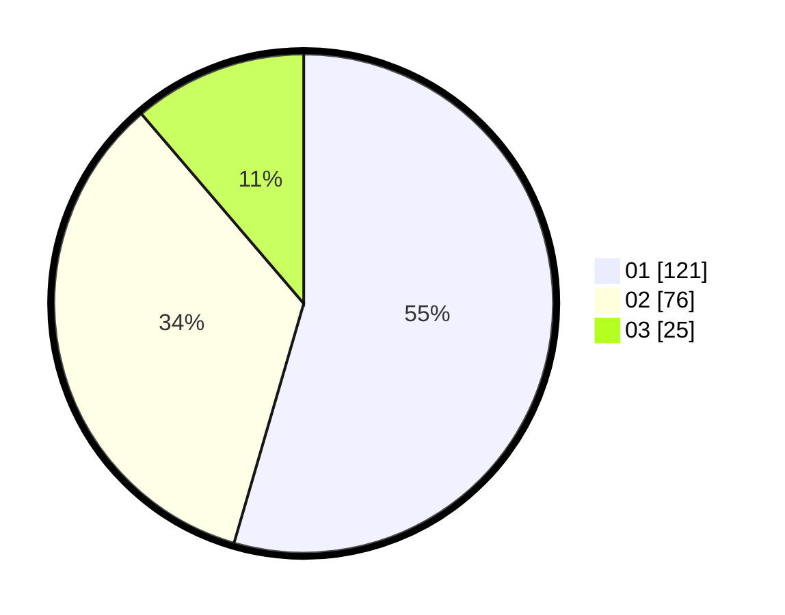

# Hasil

Hasil perolehan suara paslon dapat dilihat pada file paslon-01.txt, paslon-02.txt, dan paslon-03.txt.

Jika tidak ada, artinya data tersebut belum ada pada SIREKAP.

## Perolehan Suara

 * Paslon 01: **121**.
 * Paslon 02: **76**.
 * Paslon 03: **25**.

## Foto C Plano

https://sirekap-obj-formc.kpu.go.id/3d6e/pemilu/ppwp/31/72/03/10/06/3172031006138-20240215-021254--004e2e03-2720-490a-afc7-869ae071bef2.jpg

https://sirekap-obj-formc.kpu.go.id/3d6e/pemilu/ppwp/31/72/03/10/06/3172031006138-20240215-021647--2a1e58f6-0689-47b9-addf-b317654e5379.jpg

https://sirekap-obj-formc.kpu.go.id/3d6e/pemilu/ppwp/31/72/03/10/06/3172031006138-20240215-021912--2f72382c-eb28-439b-93fa-69a300100101.jpg
