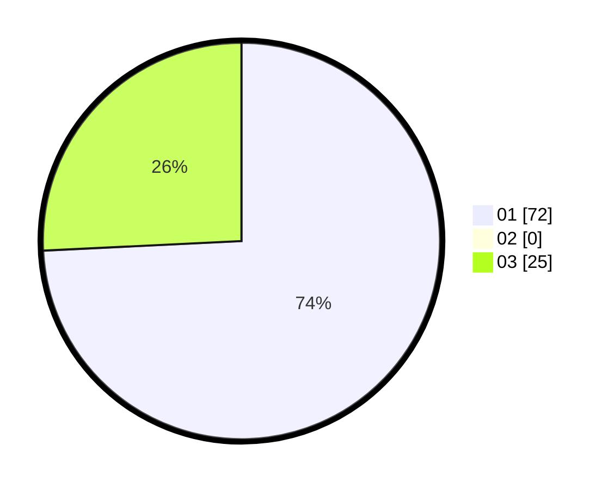

# Hasil

Hasil perolehan suara paslon dapat dilihat pada file paslon-01.txt, paslon-02.txt, dan paslon-03.txt.

Jika tidak ada, artinya data tersebut belum ada pada SIREKAP.

## Perolehan Suara

 * Paslon 01: **72**.
 * Paslon 02: **0**.
 * Paslon 03: **25**.

## Foto C Plano

https://sirekap-obj-formc.kpu.go.id/0e11/pemilu/ppwp/31/72/04/10/01/3172041001023-20240215-000034--fd84bb42-a86b-466f-bf26-c5603c12e7e8.jpg

https://sirekap-obj-formc.kpu.go.id/0e11/pemilu/ppwp/31/72/04/10/01/3172041001023-20240215-000027--40a5bd01-6a2d-4ee3-994f-d5e970b63921.jpg

https://sirekap-obj-formc.kpu.go.id/0e11/pemilu/ppwp/31/72/04/10/01/3172041001023-20240215-000043--dacde2b6-d9dd-465f-a57e-f5bbd47fcbf0.jpg

## DATA PEMILIH TETAP

Jumlah pemilih dalam DPT: **289**.
 * L: **140**.
 * P: **149**.

## DATA PENGGUNA HAK PILIH

Jumlah pengguna hak pilih dalam DPT: **204**.
 * L: **94**.
 * P: **110**.

Jumlah pengguna hak pilih dalam DPTb: **0**.
 * L: **0**.
 * P: **0**.

Jumlah pengguna hak pilih dalam DPK: **0**.
 * L: **0**.
 * P: **0**.

Jumlah pengguna hak pilih: **204**.
 * L: **94**.
 * P: **110**.

## JUMLAH SUARA SAH DAN TIDAK SAH

JUMLAH SELURUH SUARA SAH: **197**.

JUMLAH SUARA TIDAK SAH: **7**.

JUMLAH SELURUH SUARA SAH DAN SUARA TIDAK SAH: **204**.
