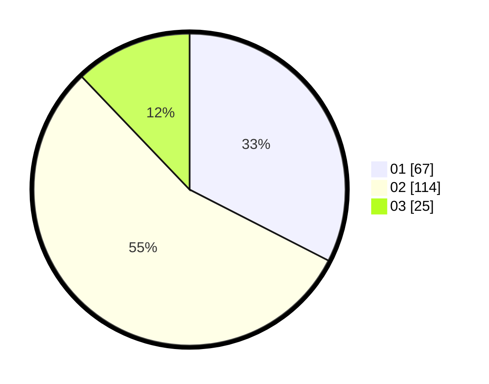

# Hasil

Hasil perolehan suara paslon dapat dilihat pada file paslon-01.txt, paslon-02.txt, dan paslon-03.txt.

Jika tidak ada, artinya data tersebut belum ada pada SIREKAP.

## Perolehan Suara

 * Paslon 01: **67**.
 * Paslon 02: **114**.
 * Paslon 03: **25**.

## Foto C Plano

https://sirekap-obj-formc.kpu.go.id/8b6a/pemilu/ppwp/31/72/04/10/01/3172041001027-20240216-150848--2fc5bb6c-47b2-4977-90c6-0cd709129843.jpg

https://sirekap-obj-formc.kpu.go.id/8b6a/pemilu/ppwp/31/72/04/10/01/3172041001027-20240214-202000--9b68c8ac-7167-4da0-b7c8-9f8cf749de19.jpg

https://sirekap-obj-formc.kpu.go.id/8b6a/pemilu/ppwp/31/72/04/10/01/3172041001027-20240214-202225--7bce910a-5acd-4e7e-a3fd-bb1bd180d54a.jpg
